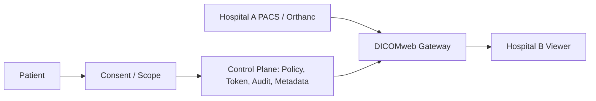

# Intermediary Role Boundary

기준일: 2026-07-11

## 현재 기술상 역할

하이패스의 현재 구현상 역할은 **LIMITED MEDICAL INFORMATION INTERMEDIARY**이다.

하이패스는 병원 A와 병원 B 사이에서 환자의 명시적 동의 범위 안에 있는 의료영상·진료정보 조회를 중계하는 제한적 플랫폼으로 설계한다.

## 하이패스가 담당하는 것

- 환자 동의 상태 관리
- 동의 범위 정책 관리
- 요청 병원, 의료진, Study, Series 검증
- RBAC + ABAC 접근정책 검증
- 단기 DICOMweb 접근토큰 발급
- Gateway routing
- 최소 의료영상 메타데이터 관리
- 감사로그와 이상행위 탐지

## 하이패스가 담당하지 않는 것

- 의료적 판단
- 원본 진료기록의 법정 원본 보존 책임
- 원본 DICOM의 장기 중앙 보관
- 영리적 연구·AI 목적 자체 결정
- 환자 데이터의 임의 2차 사용
- 동의 범위 밖 데이터 재사용
- 의료영상 판매

## 기술적 확인

| 항목 | 현재 상태 |
|---|---|
| Original DICOM persistent storage in Control Plane | NO |
| Control Plane binary DICOM storage | NO |
| DICOM upload API | NOT IDENTIFIED |
| AI training pipeline | NOT IDENTIFIED |
| 연구용 자동 반출 | NO, approval gate exists |
| 환자 데이터 영리 판매 기능 | NOT IDENTIFIED |

## 데이터 흐름

법적 지위는 기술 구현만으로 확정되지 않는다. 병원, 하이패스 운영자, 클라우드 사업자 간 계약과 실제 운영 책임에 따라 별도 법무 검토가 필요하다.
