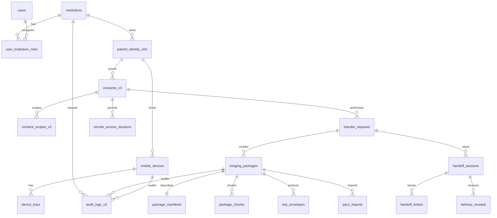

# Highpass Mobile-Core PostgreSQL ERD

> 설계용 ERD. [001_highpass_mobile_core.sql](../../db/migrations/001_highpass_mobile_core.sql)은 자동 적용하지 않는다.

## 기준

- 현재 저장소는 ORM/migration framework 없이 `pg`, `db/schema.sql`, `src/postgres-store.js` 내장 DDL을 사용한다.
- 신규 migration은 비파괴적 병행 테이블을 생성한다. Pixel Data, 평문 DEK, Token 원문은 PostgreSQL에 저장하지 않는다.
- tenant context는 검증된 `SET LOCAL app.institution_id`와 RLS를 함께 사용한다. connection pool 반환 전 transaction 종료가 필수다.

## ERD

## 데이터 사전 요약

| 테이블 | 핵심 필드·타입 | NULL/기본값·제약 | 민감도 | 암호화 | 보존·삭제 |
|---|---|---|---|---|---|
| institutions | `institution_id uuid`, code, status | PK/default UUID; code unique | INTERNAL | at rest | 계약·감사기간 |
| users / roles | issuer, subject, institution, role | issuer+subject unique | CONFIDENTIAL | at rest | 계정정책 |
| patient_identity_refs | protected ref, digest | local ref 금지, tenant unique | PHI | envelope | 목적종료·법정검토 |
| mobile_devices/device_keys | patient, platform, status, public JWK, attestation digest | key version unique; private key 금지 | CONFIDENTIAL/SECRET ref | at rest/KMS | 해지 후 digest 증적 |
| consents_v3/scopes | institutions, purpose, actions, validity, protected DICOM refs | state/check/FK; 범위 tuple unique | PHI | field+at rest | 동의·법정정책 |
| transfer_requests | consent, source/target, purpose, status | FK/check app enum | PHI | at rest | 거래증적기간 |
| imaging_packages | transfer, device, state, ciphertext URI, size, expiry | Pixel Data 금지; optimistic version | PHI metadata | at rest | 완료/만료/철회 |
| manifests/chunks | canonical hash, scope JSON, chunk hash/status | package unique; composite chunk PK | PHI/CONFIDENTIAL | manifest ciphertext | package lifecycle |
| key_envelopes | recipient, KMS ref, wrapped DEK, version/state | raw DEK 금지; recipient/version unique | SECRET | KMS envelope | disable/destroy receipt |
| handoff_sessions/tickets | B, purpose, state, token hash, jti, expiry | token/jti unique; 원문 금지 | CONFIDENTIAL/SECRET digest | at rest | TTL+replay 증적 |
| remote_access_sessions | token hash, scope JSON, expiry | token/jti unique | SECRET digest | at rest | TTL+증적 |
| pacs_imports/receipts | protocol, idempotency, result/signature | target+idempotency unique | CONFIDENTIAL | at rest/signature | B 보존 참조 |
| revocations/deletions | object ref, reason, evidence digest | append-style | CONFIDENTIAL | at rest | 증적기간 |
| policy_decisions | action, decision, context digest, version | ALLOW/DENY check | CONFIDENTIAL | at rest | 정책증적 |
| gateway_registrations | workload, cert fingerprint | unique | SECRET ref | at rest | cert lifecycle |
| temporary_cache_objects | encrypted URI, expiry, deletion | ciphertext only | CONFIDENTIAL | object encryption | 5~30분 |
| outbox/idempotency | event, request digest, bounded response | composite PK/TTL | INTERNAL | at rest | publish/TTL 후 |
| audit_logs_v3/error_events | actor/object refs, decision, safe error | append-only 목표 | CONFIDENTIAL | at rest/hash chain | `[정책 결정 필요]` |

## 기존 상태 매핑

| 기존 | 신규 |
|---|---|
| Consent `ACTIVE` | `APPROVED`(유효시간 내), 경과 시 `EXPIRED` |
| Consent `REVOKED` | `REVOKED` |
| Token `ACTIVE`/발급됨 | `AUTHORIZED` 또는 유형별 `ISSUED` |
| Token 만료 | `EXPIRED` |

기존 `consents`, `consent_scopes`, `dicom_access_token_logs`, `audit_logs`는 즉시 삭제하지 않는다. dual-read/backfill 검증 후 전환하며 `dicom_access_token_logs.token` 원문은 별도 승인 migration에서 hash로 교체한다.
