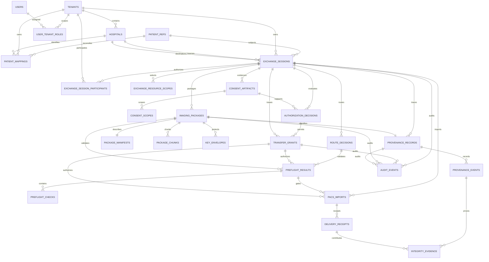

# Highpass v3 Logical ERD and Data Alignment

## Lifecycle data clarification — 2026-10-08

[PENDING staging proposal](../api/highpass-v3-consent-pending-authority-contract.md#4-proposed-additive-staging-data-not-applied-ddl)
separates immutable preparation request/scopes/actions/audit/result from approved
ConsentArtifact. Fixed PENDING/UNVERIFIED and submitted-evidence commitment do not
record approval. No proposed table or dedicated pool capability has been migrated.

[Dependency contract](../api/highpass-v3-lifecycle-dependency-contract.md) governs
proposed approval/invitation/linking data. Existing011 participant CHECK fixes
DESTINATION to INVITED; ACTIVE recipient membership needs new reviewed schema/RLS.
Consent immutable content versions must not be confused with lifecycle status events.
Approval-event/patient-binding/version references and a separate link-approval clause
are proposals D1..D4, not columns already present in migrations006..017. No DDL applied.
Do not infer evidence-read access from general active participation.

문서 버전: `v3.0-DRAFT-ALIGNMENT`
기준일: 2026-09-12
상태: **PROPOSED LOGICAL MODEL / PARTIAL ISOLATED MIGRATION IMPLEMENTATION / LIVE DB NOT APPLIED**

2026-10-07 추가: 006~014는 격리 검증용 migration이며 전체 목표 모델 구현이나 실행 DB
적용을 의미하지 않는다. Session의 `requested_actions text[]`는 불변 요청 의도이다.
신규 생성은 AccessAction 1~4개(중복 금지), 기존 행은 빈 배열 NOT CAPTURED로 보존한다.
이 필드에서 동의 또는 Grant를 추정하지 않는다. 후속 권한 검증의 상한은 요청 action과
유효한 Consent의 교집합이며, 실제 임상 접근·취소·상태 전이는 후속 구현 대상이다.

기준: [Architecture Alignment](../architecture/HIGHPASS-V3-ARCHITECTURE-ALIGNMENT.md), [Requirements v3](../requirements/highpass-v3-requirements-definition.md)

## 1. Target ERD



## 2. Ownership rules

| Entity | Ownership | Enumeration rule | RLS / authorization strategy |
|---|---|---|---|
| Tenant/Hospital | platform registry | active authorized registry scope | platform admin or own tenant |
| PatientRef | platform opaque | tenant list API 금지 | reachable only through authorized Mapping/Session |
| PatientMapping | one tenant + hospital | own hospital and role only | `tenant_id = app.tenant_id` plus hospital scope |
| ExchangeSession | owner tenant + participant tenants | active participant only | participant EXISTS + role/action ABAC |
| ConsentArtifact | Session/patient | patient or session participant role | inherit Session participant, evidence restricted |
| AuthorizationDecision | Session/policy | security/admin limited | tenant participant + privileged role |
| TransferGrant | Session/recipient tenant | issuer/recipient metadata only | no raw token, participant/action scope |
| ImagingPackage | Session | participant with package action | participant + grant + lifecycle state |
| PreflightResult | Session/route | participant/service only | participant + connector workload |
| ProvenanceRecord | Session | participant read, service append | append-only event/evidence, participant read |
| AuditEvent | event tenant/session | scoped admin only | tenant/participant + admin role |

## 3. Core table dictionary

SQL types below are target recommendations, not an executable migration.

2026-10-07 P0-04 후속: Identity의 물리 구현 초안은
`db/migrations/006_highpass_v3_identity.sql`의 `highpass_v3` namespace에 추가한다.
기존 `public.hospitals`의 문자열 ID와 v3 UUID 계약을 충돌 없이 보존하기 위한 공존 경계다.
아래 논리 테이블 이름과 API 필드는 유지한다. 기존 runtime loader에는 연결하지 않았으며
서비스/API·전체 v3 RLS 완료를 뜻하지 않는다.
[독립 DB 실행 결과](../governance/highpass-v3-p0-04-schema-2026-10-07.md)를 참조한다.

### 3.1 Identity

| Table | Column | Type / constraint | Security note |
|---|---|---|---|
| `tenants` | `tenant_id` | uuid PK | SaaS isolation boundary |
|  | `code`, `display_name`, `status` | unique code; ACTIVE/SUSPENDED/REVOKED | synthetic values in Capstone |
| `hospitals` | `hospital_id`, `tenant_id` | uuid PK/FK | Capstone tenant:hospital = 1:1 |
|  | `code`, `status`, `capability_version` | unique per tenant | no endpoint secret |
| `patient_refs` | `patient_ref` | uuid PK | platform opaque, non-enumerable |
|  | `created_at`, `deleted_at` | timestamptz | no local ID |
| `patient_mappings` | `mapping_id`, `tenant_id`, `hospital_id`, `patient_ref` | uuid PK/FKs | tenant-owned link |
|  | `protected_local_ref` | bytea NOT NULL | encrypted/protected, never API response/log |
|  | `local_ref_digest` | bytea NOT NULL | keyed digest preferred |
|  | `status` | mapping_state | NO_MATCH/MULTIPLE_MATCH/IDENTITY_CONFLICT/UNVERIFIED/VERIFIED |
|  | `evidence_digest`, `verified_by`, `verified_at` | nullable until verified | reviewer/evidence trace |
|  | `version`, timestamps | positive int | optimistic concurrency |

Unique: `(tenant_id, hospital_id, local_ref_digest)` for non-deleted mappings. 동일 local digest의 다른 PatientRef bind는 conflict 처리하며 overwrite하지 않는다.

### 3.2 Exchange and policy

Latest 012: internal source creation policies and `exchange_creation_context`
bind recorded creator/target/audit tuples by deferred FKs. This is a scoped root
creation record, not consent or destination membership. Internal patient/provider
create is now nonowner-PG tested; recipient stays INVITED and runtime/HTTP is not
activated. Directory selectors expose only chosen nonpatient institution metadata.

2026-10-07 physical foundation: migration 011 adds the five Exchange tables in
`highpass_v3`, tested only in an isolated fixture. Session REQUESTED/version 1 and
immutable scopes are enforced; SOURCE ACTIVE / DESTINATION INVITED. No app write
policy, recipient activation or clinical authorization is implemented. Snapshot
resource count/digest and correlation are internal columns, not new API properties.
Audit/result store typed safe values, not raw keys or a permissive JSON payload.

2026-10-07 dependency alignment: source-owned Session creation is not patient
consent or recipient activation. Destination participation remains pending until
explicit authority is implemented; do not grant PatientRef visibility merely from
targetHospitalId. Session/participant persistence is not yet migrated. See
[cross-institution authority contract](../api/highpass-v3-cross-institution-identity-contract.md).

| Table | Key columns | Required constraints |
|---|---|---|
| `exchange_sessions` | `session_id`, `owner_tenant_id`, `patient_ref`, source/destination hospital, requester, initiation_type, purpose, state, expires_at, version, trace_id, audit_session_id | source != destination; terminal immutable; finite expiry |
| `exchange_session_participants` | `session_id`, `tenant_id`, `hospital_id`, participant_role, status | composite PK; SOURCE/DESTINATION; active participant ACL |
| `exchange_resource_scopes` | `scope_id`, `session_id`, study_ref, optional series/instance/frame | exact hierarchy constraints; canonical snapshot digest |
| `consent_artifacts` | `consent_id`, `session_id`, `patient_ref`, source/recipient, purpose, status, version, policy_version, evidence_digest, valid window | `(session_id, version)` unique; prior version immutable |
| `consent_scopes` | `consent_id`, resource scope/action | no scope wider than Session snapshot |
| `authorization_decisions` | `decision_id`, `session_id`, `consent_id`, actor/tenant/action, ALLOW/DENY, reason, context_digest, policy_version, decided_at | immutable; no raw context/PHI |
| `transfer_grants` | `grant_id`, `session_id`, `decision_id`, issuer/audience/jti, recipient tenant/hospital, actions, resource_snapshot_digest, token_hash, one_time, status, issued/expires/used/revoked | jti/token_hash unique; no raw token; expires > issued |

### 3.3 Package, route and preflight

| Table | Key columns | Required constraints |
|---|---|---|
| `imaging_packages` | `package_id`, `session_id`, package_version, status, payload_location_ref, total_size, manifest_digest, encryption_profile, provenance_id, expires_at | `(session_id, package_version)` unique; no Pixel Data in DB |
| `package_manifests` | `manifest_id`, `package_id`, schema_version, canonical_hash, study/instance/frame counts, protected_manifest_ref | one per package version; protected metadata external/encrypted |
| `package_chunks` | package_id, chunk_no, size, cipher_hash, status | composite PK; hash/size required |
| `route_decisions` | `route_decision_id`, `session_id`, route, actions, rule/policy/capability versions, context_digest, selected_at | immutable; route enum; no AI result |
| `preflight_results` | `preflight_id`, `session_id`, route_decision_id, grant_id, optional package_id, overall_result, reason_code, capability_version, checked_at, expires_at | PASS/WARNING/FAIL; expires > checked |
| `preflight_checks` | preflight_id, check_type, result, safe_code, evidence_digest, latency_ms, checked_at | identity/consent/grant/tenant/integrity checks cannot be warning-eligible |

### 3.4 Transfer, provenance and audit

| Table | Key columns | Required constraints |
|---|---|---|
| `pacs_imports` | import_id, session/package/grant/preflight IDs, destination hospital, protocol, idempotency_key, status, object counts | P0 protocol STOW_RS; unique destination+idempotency |
| `delivery_receipts` | receipt_id, import/session/package, result, expected/success/failed counts, manifest/evidence digest, receiver, received_at | result derived from object results, not manually PASS |
| `provenance_records` | provenance_id, session_id, package_id unique, transfer_mode, source/destination hospital, final_status, started/completed | one provenance per package version; BIT_PRESERVING/TRANSCODED; PENDING/PASS/FAIL/NOT_VERIFIED |
| `provenance_events` | event_id, provenance_id, sequence_no, type, actor/workload, hospital, event_time, previous/record hash | unique provenance+sequence; append-only |
| `integrity_evidence` | evidence_id, provenance_event_id, level, algorithm, source/destination digest, SOP identity digest, semantic result, transform ref, receipt ref | evidence type-specific check constraints |
| `audit_events` | event_id, tenant/session/consent/grant/package/provenance refs, actor/action/decision/reason/trace/time, previous/record hash | append-only; PHI/token/key prohibited |

## 4. Canonical enums

```text
mapping_state:
NO_MATCH, MULTIPLE_MATCH, IDENTITY_CONFLICT, UNVERIFIED, VERIFIED

exchange_state:
REQUESTED, IDENTITY_PENDING, CONSENT_PENDING, CONSENTED,
AUTHORIZED, PREFLIGHT, READY, ACTIVE,
VIEWING, DOWNLOADING, TRANSFERRING, MOBILE_EXPORTING,
COMPLETED, REJECTED, EXPIRED, REVOKED, FAILED, CANCELLED

consent_state:
PENDING, ACTIVE, REJECTED, WITHDRAWN, EXPIRED

grant_state:
ISSUED, ACTIVE, CONSUMED, EXPIRED, REVOKED

route_type:
PACS_DIRECT, CLOUD_VIEW, CLOUD_DOWNLOAD, CLOUD_RELAY, MOBILE_VAULT

preflight_result:
PASS, WARNING, FAIL

transfer_mode:
BIT_PRESERVING, TRANSCODED

integrity_status:
PENDING, PASS, FAIL, NOT_VERIFIED
```

## 5. State compatibility mapping

| Legacy | Target | Rule |
|---|---|---|
| `consents.ACTIVE`, `consents_v3.APPROVED` | ConsentArtifact ACTIVE | only inside validity window |
| `consents.REVOKED`, `consents_v3.REVOKED` | WITHDRAWN | preserve legacy event name in migration audit |
| `transfer_requests.*` | ExchangeSession state | explicit mapping table required; no guess for unknown status |
| `remote_access_sessions` active row | TransferGrant ACTIVE | validate token hash/jti/expiry/scope first |
| `handoff_tickets` | P1 bootstrap grant/ticket | never backfill as P0 Session itself |
| `package_state_v3` | Package lifecycle | route-neutral states; mobile-only states become route events |
| `delivery_receipts.result` | Provenance evidence | not final PASS until integrity rule evaluates |

Unmapped/unknown legacy state is quarantined as migration error and never converted to ALLOW/ACTIVE.

## 6. Index and constraint recommendations

- active Mapping: `(tenant_id, hospital_id, local_ref_digest)` partial unique
- participant authorization: `(tenant_id, session_id, status)`
- Session inbox: `(destination_hospital_id, state, created_at desc)`
- Session expiry worker: `(state, expires_at)` excluding terminal
- active Grant: unique `jti`, unique `token_hash`; `(recipient_tenant_id, status, expires_at)`
- latest Preflight: `(session_id, route_decision_id, checked_at desc)`
- Package lifecycle: `(session_id, status, expires_at)`
- Provenance events: unique `(provenance_id, sequence_no)`
- Audit search: `(tenant_id, event_time desc, event_type)`; session correlation index
- no index includes raw/protected local patient identifier or token plaintext

## 7. RLS and transaction rules

1. Application transaction sets validated `app.tenant_id` and actor context with `SET LOCAL`.
2. PatientMapping uses direct tenant ownership RLS.
3. Exchange children use `EXISTS` against active `exchange_session_participants` plus app-layer ABAC.
4. Cross-tenant Session writes require service function/transaction that validates both participant hospitals; direct table grants are denied.
5. Audit/provenance append and state mutation use transactional outbox or the same transaction.
6. connection pool returns only after transaction end; no tenant context leakage.
7. privileged break-glass is not part of Capstone P0.

## 8. Retention and deletion

| Data | P0 handling | Production decision |
|---|---|---|
| PatientMapping/Consent/Session metadata | configurable synthetic retention, deletion/audit workflow | legal/contract retention |
| Grant token hash/jti | TTL plus security evidence window | security policy/legal review |
| encrypted payload/cache | purpose-specific finite TTL, deletion receipt | hospital/processor contract |
| key envelope | disable/destroy on lifecycle trigger | production KMS policy |
| provenance/audit | append-only test evidence | WORM/SIEM/legal retention |
| B PACS imported copy | B Test Orthanc cleanup in Capstone | destination hospital record policy |

No retention number is frozen in this ERD.

## 9. Migration plan — not executed

| Step | Change | Validation | Rollback |
|---|---|---|---|
| M1 | create tenant/hospital/patient_ref/mapping tables | synthetic uniqueness/RLS | drop new empty tables only |
| M2 | create Session/participant/scope tables | state/idempotency/tenant tests | disable v3 writes |
| M3 | add consent/decision/grant compatibility | dual-read comparison | legacy read remains |
| M4 | add package session link/route/preflight | package scope and no-payload DB scan | feature flag off |
| M5 | add provenance/evidence refs | backfill digest reference counts | preserve source evidence |
| M6 | add participant-aware RLS | cross-tenant positive/negative | revert policy, keep app ABAC |
| M7 | parity and cutover | v2.1+v3 suites, rollback rehearsal | restore legacy writer |

별도 승인된 migration 파일을 작성·dry-run하기 전까지 본 문서는 논리모델일 뿐이다.

## 10. ERD alignment status

| Object | Logical table | Legacy source | Status |
|---|---|---|---|
| PatientMapping | patient_refs/patient_mappings | patient_identity_refs, PHR mapping | ALIGNED — proposed |
| ExchangeSession | sessions/participants/scopes | transfer_requests/handoff_sessions | ALIGNED — proposed |
| TransferGrant | transfer_grants | remote_access_sessions/token logs | ALIGNED — proposed |
| PreflightResult | preflight_results/checks | PHR mapping probes | ALIGNED — proposed |
| Provenance | provenance records/events/evidence | manifest/hash/receipt/audit | ALIGNED — proposed |

최종 판정: **LOGICAL ERD ALIGNED / FULL PHYSICAL MIGRATION NOT VERIFIED**

## 2026-10-07 Identity 물리 스키마 한정

`006_highpass_v3_identity.sql`은 `highpass_v3`의 tenant/hospital/patient_refs/patient_mappings,
`007_highpass_v3_identity_transactions.sql`은 principal_bindings/identity_audit_outbox를 추가했다.
독립 합성 PostgreSQL에서 적용/rollback/RLS/transaction 검증을 실행했다.
[실행 기록](../governance/highpass-v3-p0-04-transactions-metadata-2026-10-07.md)을 따른다.
기존 runtime DB에는 적용하지 않았다. 전체 v3 migration 완료는 아니다.

principal_bindings는 actor UUID, tenant/hospital, role/scopes/status 및 optional patient_ref다.
outbox는 actor/mapping/version, auditSession/trace, action/result/reason, old/new state,
evidence digest/time을 저장하며 mapping 없는 안전한 DENY도 지원한다.
이는 최종 audit_events hash chain/WORM이 아니다.
`008_highpass_v3_patient_ref_registration.sql`은 patient_refs에 nullable owner_tenant_id,
owner_hospital_id, registered_by를 추가한다. 세 필드는 전체 NULL(기존) 또는 전체 non-NULL(신규)이다.
기존 row backfill은 없고 신규 owner read/insert RLS 및 감사 patient_ref FK/생성 이벤트 제약을 추가한다.
기존 mapping에 의한 기관별 global ref 읽기 정책은 보존한다. 신규 API bootstrap은 내부 서비스만이며
교차기관 ref linking 승인·membership과 durable idempotency는 아직 없다.
후속 `009_highpass_v3_identity_idempotency.sql`은 기관/actor/operation 범위의
identity_write_results를 추가했다. key_digest/request_digest는 HMAC bytea32, patient_ref/mapping FK,
response_metadata는 정해진 metadata key/type만 허용하는 JSONB, recorded_at은 DB 시각이다.
RLS SELECT/INSERT와 UPDATE/DELETE 거부 trigger를 사용하며 app에는 SELECT/INSERT만 부여한다.
PatientRef replay의 FOR SHARE를 위해 patient_ref column lock 권한 및 UPDATE USING/WITH CHECK(false)를 추가한다.
이는 실제 ref/owner 변경 허가가 아니다. 009 시점에는 등록 서비스 idempotency만 연결했으며
Mapping/review의 최신 연결 상태는 아래 010 후속을 따른다.
010 후속은 patient_mappings.registered_by, maker/checker 전이 guard 및 deferred 감사 제약을 추가했다.
Mapping INSERT 정책이 patient_refs의 mapping 기반 읽기 정책과 순환하지 않도록
patient_ref_registrations(root: patient_ref PK, tenant/hospital/registered_by, 실제 owner tuple FK)를 추가했다.
이 root는 기관 소유권 기록이며 consent/교차기관 membership 승인 객체가 아니다.
기존 명시 owner만 복사하고 NULL maker/owner를 추정하지 않는다. RLS SELECT/INSERT 및 UPDATE/DELETE 거부를 적용한다.
새 PatientRef 서비스는 010까지의 스키마를 필요로 한다. 기존 runtime에는 migration을 적용하지 않았다.
own-ref Mapping 내부 전이와 ledger 연결은 검증했으며 실제 HTTP 및 cross-institution ref 연결은 잔여다.
[Mapping write 계약](../api/highpass-v3-mapping-write-contract.md)의 등록 actor·review state transition·
idempotency ledger 및 bootstrap HTTP는 후속 DDL/서비스/검증 대상이다.

## 2026-10-08 PENDING staging physical foundation

018 introduces consent_preparation_requests/scopes/actions/audit_outbox/results,
separate from approved ConsentArtifact versions and Session state events.
All five tables FORCE RLS, with no admission policies/runtime grants in this gate.
Source/target/actor tuple FKs, same-version typed creation audit, original receipt,
scope digest/subset and deferred child-count proof bind immutable assembly.
State/evidence remain PENDING/UNVERIFIED; no patient approval, Grant or INVITED
activation is inferred. Tested only in owned disposable PostgreSQL; actual nonowner
authority/write/retry/race and retention/deletion policies remain future work.

019 follow-up implements source-only nonowner READ/LOCK policies on existing authority
tables, not staging INSERT. Creation root is nonrecursive, patient bound-ref/doctor
requester-scoped. Minimal column privileges and actual JS projection checked in
isolated fixture; no runtime enrollment. Staging writes/approval/retry/races remain.

020 follow-up adds own-actor staging SELECT/INSERT and append-only typed audit
admission, without runtime grants or approval semantics. Internal atomic service
stores canonical scopes/actions, keyed evidence commitment and original minimal
receipt in one transaction. Actual nonowner PG222 tests include matching/changed/
concurrent retry, lost COMMIT ACK, expired window and audit/ledger rollback.
Complete PA role/tenant/direct assembly/race coverage and public transport remain
unverified. See [internal write report](../governance/highpass-v3-p0-06-pending-write-2026-10-08.md).

Later PG283 evidence adds named residual assembly/authority and actual loopback
HTTP/HTTPS-to-PG tests without new schema objects. Certificate/input failures do
not create staging rows; domain and pre-callback denial are distinguished.
This is not runtime enrollment, client mTLS/ingress/PoP/MFA or clinical approval.
See [actual transport report](../governance/highpass-v3-p0-06-pending-live-transport-2026-10-08.md).

## 2026-10-08 patient ceremony physical foundation

Additive023 introduces `consent_patient_ceremonies` and
`consent_patient_ceremony_audit`, NOT completed ConsentArtifact/state-event tables.
Preparation/session/version/patient/source/target composite FK binds immutable
challenge context; the patient actor is distinct from the preparation creator.
Nonce hash is unique, raw nonce is absent, and displayed content digest binds
server-owned ordered resources/actions plus independent linking clause/version/
text digest/purpose/finite window. Cyclic deferred creation audit FKs require exact
actor/patient/correlation/time assembly. Both tables FORCE RLS; no admission
policy/login grants/runtime migration. Existing PENDING/UNVERIFIED, REQUESTED and
INVITED are not updated. See [ADR](../architecture/highpass-v3-patient-ceremony-persistence-adr.md).
Owner constraints/default-deny tests do not prove signed ceremony issuance,
patient-only nonowner projection, one-time consumption, D6 or clinical approval.

024 follow-up adds patient-only internal READ/LOCK RLS to preparation/children,
Session/ref/source participant and target registry under approval capability,
without new tables, runtime grants or ceremony INSERT. Fixture-only minimum columns
exclude submitted commitment/creator audit/Mapping. Creator-independent patient
read and locks are actual SQL-tested, not a guarded JS/public audited API or approval.
See [projection contract](../api/highpass-v3-patient-approval-projection-contract.md)
and [actual RLS execution](../governance/highpass-v3-patient-approval-rls-2026-10-08.md).

## 2026-10-07 legacy security ledger addendum

`db/migrations/005_dpop_replay_store.sql`은 신규 v3 임상 논리모델과 별개인
legacy DPoP 보안 ledger의 additive DDL이다. 위 표 전체의 물리 migration 완료를 뜻하지 않는다.

| 내부 테이블 | 필드 | 수명·경계 |
|---|---|---|
| dpop_replay_entries | proof_hash char(64) PK, expires_at timestamptz | SHA-256(issuer/key thumbprint/jti), DB 시각 기준 200초 |

원문 JWT/proof/JWK/jti와 임상정보는 저장하지 않는다. 임상 FK가 없으며 legacy
bulk save/TRUNCATE에서 제외해 replay 기록이 초기화되지 않도록 한다.
동시 claim은 `INSERT ... ON CONFLICT ... WHERE expired`로 원자적으로 판정한다.
만료 hash 정리는 최대 512행씩이며 임상/감사로그를 삭제하지 않는다.
만료는 논리 판정 기준이다. 요청 기반 정리이므로 유휴 상태의 물리 삭제 SLA는 미검증이다.
rollback은 호출 경로를 검토해 전환하되 유효 proof window 안의 ledger를 삭제·초기화하지 않는다.
운영 최소권한·TLS verify-full·failover·전체 API HA는 별도 검토 대상이다.

## Patient challenge issuance and next content/event alignment — 2026-10-08

Additive025 adds `consent_patient_challenge_results`: source tenant/hospital,
patient actor/ref, fixed CHALLENGE_ISSUE, HMAC key/request digests, exact immutable
ceremony/preparation/session/version/content/issued/expiry tuple, fixed ISSUED.
No raw nonce/key/response-secret column. Composite FKs and deferred receipt proof
complement023 creation audit. Scoped patient SELECT/INSERT only; default UPDATE/
DELETE denial and immutable trigger; no runtime login/grants. Minimal preparation
columns replace023 SELECT-star assembly without weakening its validations.

[Issuance contract](../api/highpass-v3-patient-challenge-issuance-contract.md) distinguishes
historical pre025 schema fixtures from actual service-issued receipts. Internal
guarded JS service and actual PG prove issuance only, not consumed ConsentArtifact.

Next [content/state-event design](../api/highpass-v3-patient-consent-decision-persistence-contract.md)
separates immutable content root/scopes/actions/linking clause (contentVersion),
append-only lifecycle events (eventSequence), unique challenge consumption plus
preparation initial decision and typed safe receipt. Initial PENDING→ACTIVE or
REJECTED are artifact events, not Session/recipient/Mapping/Grant changes. New
physical tables are now PARTIAL ISOLATED IMPLEMENTATION: additive026 materializes
content root/scopes/actions, state events, exact audit, one-time decision and typed
receipt only in owned disposable PG. See [initial decision results](../governance/highpass-v3-patient-decision-execution-2026-10-08.md)
and [deadline/lock evidence](../governance/highpass-v3-patient-decision-deadline-execution-2026-10-08.md).
Live DB not applied; initial contentVersion1/events1..2 only. WITHDRAWN/EXPIRED,
replacement versions, admin read, full D6 and clinical authority remain incomplete.

## Proposed post-decision lifecycle — 2026-10-08

[Lifecycle ADR](../architecture/highpass-v3-consent-lifecycle-adr.md) proposes a separate
post-initial terminal event3, exact real actor/subject separation, immutable audit,
typed receipt and cascade REQUESTED. Initial content/version/scopes/decision remain
unchanged; initial event1/2 plus later events form one logical lifecycle stream.
Additive027 defines consent_lifecycle_events/audit/results/cascade in an owned disposable
DB test only. It links immutable initial content and ACTIVE event2 to a unique terminal
event3, separates subject from actual actor, and requires atomic reciprocal audit,
typed result and REQUESTED cascade. The WITHDRAWN/EXPIRED private services are NOT IMPLEMENTED.
L1~L5 policies were adopted by 김범희 on 2026-10-08 in the
[decision packet](../governance/highpass-v3-consent-lifecycle-policy-packet-2026-10-08.md).
Isolated schema/private withdrawal projection PASS 208; lifecycle services and full D6 remain incomplete;
no migration/runtime enrollment. Direct SQL fixture metadata is not cryptographic reauth proof.

028 follow-up adds immutable/FORCE RLS consent_withdrawal_outcomes for admitted retry/denial:
actual actor/source/ref, HMAC selector/key digest, fixed reason/correlation and optional exact
historical event FK. No raw foreign consent selector, key or token. Internal withdrawal service
and historical/live private context split are under isolated verification; expiry service,
public audited read and downstream revocation remain incomplete.
