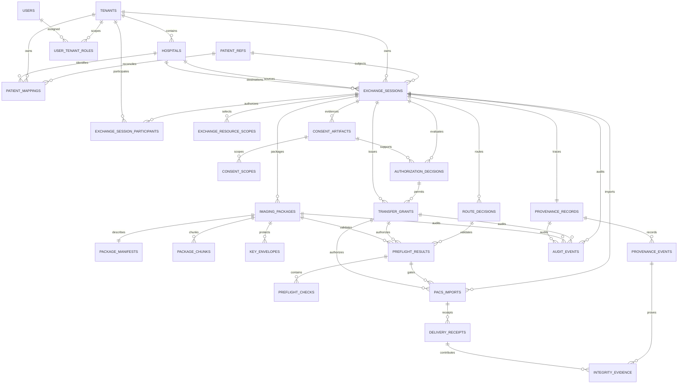

# Highpass v3 Logical ERD and Data Alignment

문서 버전: `v3.0-DRAFT-ALIGNMENT`
기준일: 2026-09-12
상태: **PROPOSED LOGICAL MODEL / MIGRATION NOT CREATED OR APPLIED**

기준: [Architecture Alignment](../architecture/HIGHPASS-V3-ARCHITECTURE-ALIGNMENT.md), [Requirements v3](../requirements/highpass-v3-requirements-definition.md)

## 1. Target ERD



## 2. Ownership rules

| Entity | Ownership | Enumeration rule | RLS / authorization strategy |
|---|---|---|---|
| Tenant/Hospital | platform registry | active authorized registry scope | platform admin or own tenant |
| PatientRef | platform opaque | tenant list API 금지 | reachable only through authorized Mapping/Session |
| PatientMapping | one tenant + hospital | own hospital and role only | `tenant_id = app.tenant_id` plus hospital scope |
| ExchangeSession | owner tenant + participant tenants | active participant only | participant EXISTS + role/action ABAC |
| ConsentArtifact | Session/patient | patient or session participant role | inherit Session participant, evidence restricted |
| AuthorizationDecision | Session/policy | security/admin limited | tenant participant + privileged role |
| TransferGrant | Session/recipient tenant | issuer/recipient metadata only | no raw token, participant/action scope |
| ImagingPackage | Session | participant with package action | participant + grant + lifecycle state |
| PreflightResult | Session/route | participant/service only | participant + connector workload |
| ProvenanceRecord | Session | participant read, service append | append-only event/evidence, participant read |
| AuditEvent | event tenant/session | scoped admin only | tenant/participant + admin role |

## 3. Core table dictionary

SQL types below are target recommendations, not an executable migration.

### 3.1 Identity

| Table | Column | Type / constraint | Security note |
|---|---|---|---|
| `tenants` | `tenant_id` | uuid PK | SaaS isolation boundary |
|  | `code`, `display_name`, `status` | unique code; ACTIVE/SUSPENDED/REVOKED | synthetic values in Capstone |
| `hospitals` | `hospital_id`, `tenant_id` | uuid PK/FK | Capstone tenant:hospital = 1:1 |
|  | `code`, `status`, `capability_version` | unique per tenant | no endpoint secret |
| `patient_refs` | `patient_ref` | uuid PK | platform opaque, non-enumerable |
|  | `created_at`, `deleted_at` | timestamptz | no local ID |
| `patient_mappings` | `mapping_id`, `tenant_id`, `hospital_id`, `patient_ref` | uuid PK/FKs | tenant-owned link |
|  | `protected_local_ref` | bytea NOT NULL | encrypted/protected, never API response/log |
|  | `local_ref_digest` | bytea NOT NULL | keyed digest preferred |
|  | `status` | mapping_state | NO_MATCH/MULTIPLE_MATCH/IDENTITY_CONFLICT/UNVERIFIED/VERIFIED |
|  | `evidence_digest`, `verified_by`, `verified_at` | nullable until verified | reviewer/evidence trace |
|  | `version`, timestamps | positive int | optimistic concurrency |

Unique: `(tenant_id, hospital_id, local_ref_digest)` for non-deleted mappings. 동일 local digest의 다른 PatientRef bind는 conflict 처리하며 overwrite하지 않는다.

### 3.2 Exchange and policy

| Table | Key columns | Required constraints |
|---|---|---|
| `exchange_sessions` | `session_id`, `owner_tenant_id`, `patient_ref`, source/destination hospital, requester, initiation_type, purpose, state, expires_at, version, trace_id, audit_session_id | source != destination; terminal immutable; finite expiry |
| `exchange_session_participants` | `session_id`, `tenant_id`, `hospital_id`, participant_role, status | composite PK; SOURCE/DESTINATION; active participant ACL |
| `exchange_resource_scopes` | `scope_id`, `session_id`, study_ref, optional series/instance/frame | exact hierarchy constraints; canonical snapshot digest |
| `consent_artifacts` | `consent_id`, `session_id`, `patient_ref`, source/recipient, purpose, status, version, policy_version, evidence_digest, valid window | `(session_id, version)` unique; prior version immutable |
| `consent_scopes` | `consent_id`, resource scope/action | no scope wider than Session snapshot |
| `authorization_decisions` | `decision_id`, `session_id`, `consent_id`, actor/tenant/action, ALLOW/DENY, reason, context_digest, policy_version, decided_at | immutable; no raw context/PHI |
| `transfer_grants` | `grant_id`, `session_id`, `decision_id`, issuer/audience/jti, recipient tenant/hospital, actions, resource_snapshot_digest, token_hash, one_time, status, issued/expires/used/revoked | jti/token_hash unique; no raw token; expires > issued |

### 3.3 Package, route and preflight

| Table | Key columns | Required constraints |
|---|---|---|
| `imaging_packages` | `package_id`, `session_id`, package_version, status, payload_location_ref, total_size, manifest_digest, encryption_profile, provenance_id, expires_at | `(session_id, package_version)` unique; no Pixel Data in DB |
| `package_manifests` | `manifest_id`, `package_id`, schema_version, canonical_hash, study/instance/frame counts, protected_manifest_ref | one per package version; protected metadata external/encrypted |
| `package_chunks` | package_id, chunk_no, size, cipher_hash, status | composite PK; hash/size required |
| `route_decisions` | `route_decision_id`, `session_id`, route, actions, rule/policy/capability versions, context_digest, selected_at | immutable; route enum; no AI result |
| `preflight_results` | `preflight_id`, `session_id`, route_decision_id, grant_id, optional package_id, overall_result, reason_code, capability_version, checked_at, expires_at | PASS/WARNING/FAIL; expires > checked |
| `preflight_checks` | preflight_id, check_type, result, safe_code, evidence_digest, latency_ms, checked_at | identity/consent/grant/tenant/integrity checks cannot be warning-eligible |

### 3.4 Transfer, provenance and audit

| Table | Key columns | Required constraints |
|---|---|---|
| `pacs_imports` | import_id, session/package/grant/preflight IDs, destination hospital, protocol, idempotency_key, status, object counts | P0 protocol STOW_RS; unique destination+idempotency |
| `delivery_receipts` | receipt_id, import/session/package, result, expected/success/failed counts, manifest/evidence digest, receiver, received_at | result derived from object results, not manually PASS |
| `provenance_records` | provenance_id, session_id unique, package_id, transfer_mode, source/destination hospital, final_status, started/completed | BIT_PRESERVING/TRANSCODED; PENDING/PASS/FAIL/NOT_VERIFIED |
| `provenance_events` | event_id, provenance_id, sequence_no, type, actor/workload, hospital, event_time, previous/record hash | unique provenance+sequence; append-only |
| `integrity_evidence` | evidence_id, provenance_event_id, level, algorithm, source/destination digest, SOP identity digest, semantic result, transform ref, receipt ref | evidence type-specific check constraints |
| `audit_events` | event_id, tenant/session/consent/grant/package/provenance refs, actor/action/decision/reason/trace/time, previous/record hash | append-only; PHI/token/key prohibited |

## 4. Canonical enums

```text
mapping_state:
NO_MATCH, MULTIPLE_MATCH, IDENTITY_CONFLICT, UNVERIFIED, VERIFIED

exchange_state:
REQUESTED, IDENTITY_PENDING, CONSENT_PENDING, CONSENTED,
AUTHORIZED, PREFLIGHT, READY, ACTIVE,
VIEWING, DOWNLOADING, TRANSFERRING, MOBILE_EXPORTING,
COMPLETED, REJECTED, EXPIRED, REVOKED, FAILED, CANCELLED

consent_state:
PENDING, ACTIVE, REJECTED, WITHDRAWN, EXPIRED

grant_state:
ISSUED, ACTIVE, CONSUMED, EXPIRED, REVOKED

route_type:
PACS_DIRECT, CLOUD_VIEW, CLOUD_DOWNLOAD, CLOUD_RELAY, MOBILE_VAULT

preflight_result:
PASS, WARNING, FAIL

transfer_mode:
BIT_PRESERVING, TRANSCODED

integrity_status:
PENDING, PASS, FAIL, NOT_VERIFIED
```

## 5. State compatibility mapping

| Legacy | Target | Rule |
|---|---|---|
| `consents.ACTIVE`, `consents_v3.APPROVED` | ConsentArtifact ACTIVE | only inside validity window |
| `consents.REVOKED`, `consents_v3.REVOKED` | WITHDRAWN | preserve legacy event name in migration audit |
| `transfer_requests.*` | ExchangeSession state | explicit mapping table required; no guess for unknown status |
| `remote_access_sessions` active row | TransferGrant ACTIVE | validate token hash/jti/expiry/scope first |
| `handoff_tickets` | P1 bootstrap grant/ticket | never backfill as P0 Session itself |
| `package_state_v3` | Package lifecycle | route-neutral states; mobile-only states become route events |
| `delivery_receipts.result` | Provenance evidence | not final PASS until integrity rule evaluates |

Unmapped/unknown legacy state is quarantined as migration error and never converted to ALLOW/ACTIVE.

## 6. Index and constraint recommendations

- active Mapping: `(tenant_id, hospital_id, local_ref_digest)` partial unique
- participant authorization: `(tenant_id, session_id, status)`
- Session inbox: `(destination_hospital_id, state, created_at desc)`
- Session expiry worker: `(state, expires_at)` excluding terminal
- active Grant: unique `jti`, unique `token_hash`; `(recipient_tenant_id, status, expires_at)`
- latest Preflight: `(session_id, route_decision_id, checked_at desc)`
- Package lifecycle: `(session_id, status, expires_at)`
- Provenance events: unique `(provenance_id, sequence_no)`
- Audit search: `(tenant_id, event_time desc, event_type)`; session correlation index
- no index includes raw/protected local patient identifier or token plaintext

## 7. RLS and transaction rules

1. Application transaction sets validated `app.tenant_id` and actor context with `SET LOCAL`.
2. PatientMapping uses direct tenant ownership RLS.
3. Exchange children use `EXISTS` against active `exchange_session_participants` plus app-layer ABAC.
4. Cross-tenant Session writes require service function/transaction that validates both participant hospitals; direct table grants are denied.
5. Audit/provenance append and state mutation use transactional outbox or the same transaction.
6. connection pool returns only after transaction end; no tenant context leakage.
7. privileged break-glass is not part of Capstone P0.

## 8. Retention and deletion

| Data | P0 handling | Production decision |
|---|---|---|
| PatientMapping/Consent/Session metadata | configurable synthetic retention, deletion/audit workflow | legal/contract retention |
| Grant token hash/jti | TTL plus security evidence window | security policy/legal review |
| encrypted payload/cache | purpose-specific finite TTL, deletion receipt | hospital/processor contract |
| key envelope | disable/destroy on lifecycle trigger | production KMS policy |
| provenance/audit | append-only test evidence | WORM/SIEM/legal retention |
| B PACS imported copy | B Test Orthanc cleanup in Capstone | destination hospital record policy |

No retention number is frozen in this ERD.

## 9. Migration plan — not executed

| Step | Change | Validation | Rollback |
|---|---|---|---|
| M1 | create tenant/hospital/patient_ref/mapping tables | synthetic uniqueness/RLS | drop new empty tables only |
| M2 | create Session/participant/scope tables | state/idempotency/tenant tests | disable v3 writes |
| M3 | add consent/decision/grant compatibility | dual-read comparison | legacy read remains |
| M4 | add package session link/route/preflight | package scope and no-payload DB scan | feature flag off |
| M5 | add provenance/evidence refs | backfill digest reference counts | preserve source evidence |
| M6 | add participant-aware RLS | cross-tenant positive/negative | revert policy, keep app ABAC |
| M7 | parity and cutover | v2.1+v3 suites, rollback rehearsal | restore legacy writer |

별도 승인된 migration 파일을 작성·dry-run하기 전까지 본 문서는 논리모델일 뿐이다.

## 10. ERD alignment status

| Object | Logical table | Legacy source | Status |
|---|---|---|---|
| PatientMapping | patient_refs/patient_mappings | patient_identity_refs, PHR mapping | ALIGNED — proposed |
| ExchangeSession | sessions/participants/scopes | transfer_requests/handoff_sessions | ALIGNED — proposed |
| TransferGrant | transfer_grants | remote_access_sessions/token logs | ALIGNED — proposed |
| PreflightResult | preflight_results/checks | PHR mapping probes | ALIGNED — proposed |
| Provenance | provenance records/events/evidence | manifest/hash/receipt/audit | ALIGNED — proposed |

최종 판정: **LOGICAL ERD ALIGNED / PHYSICAL MIGRATION NOT VERIFIED**

