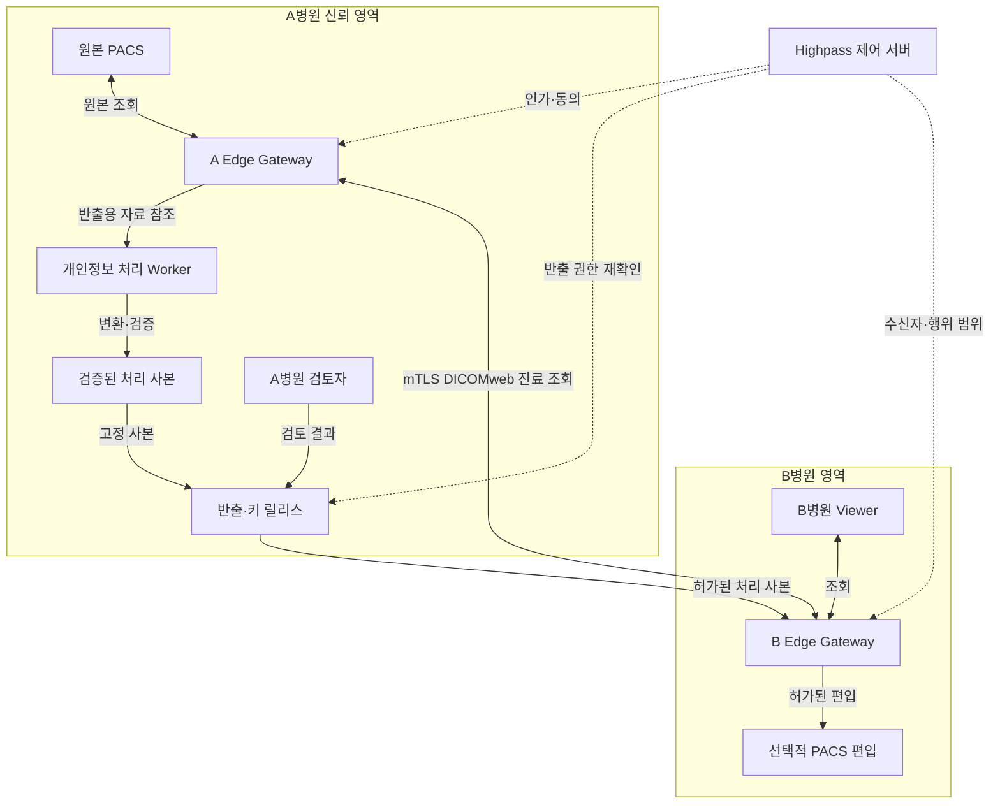
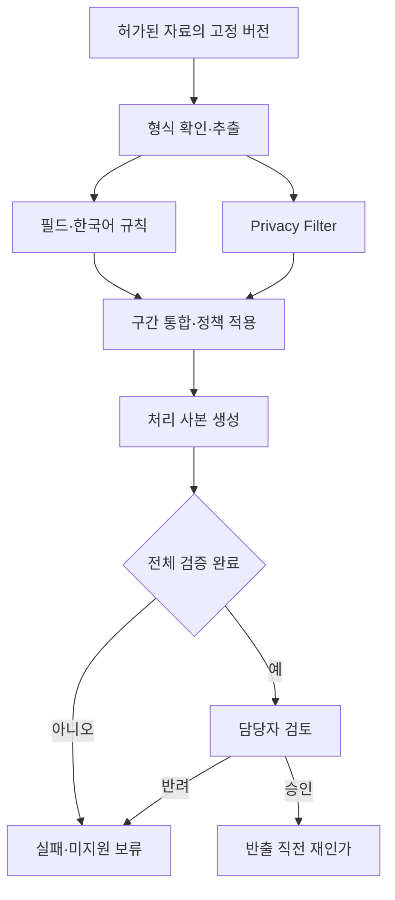
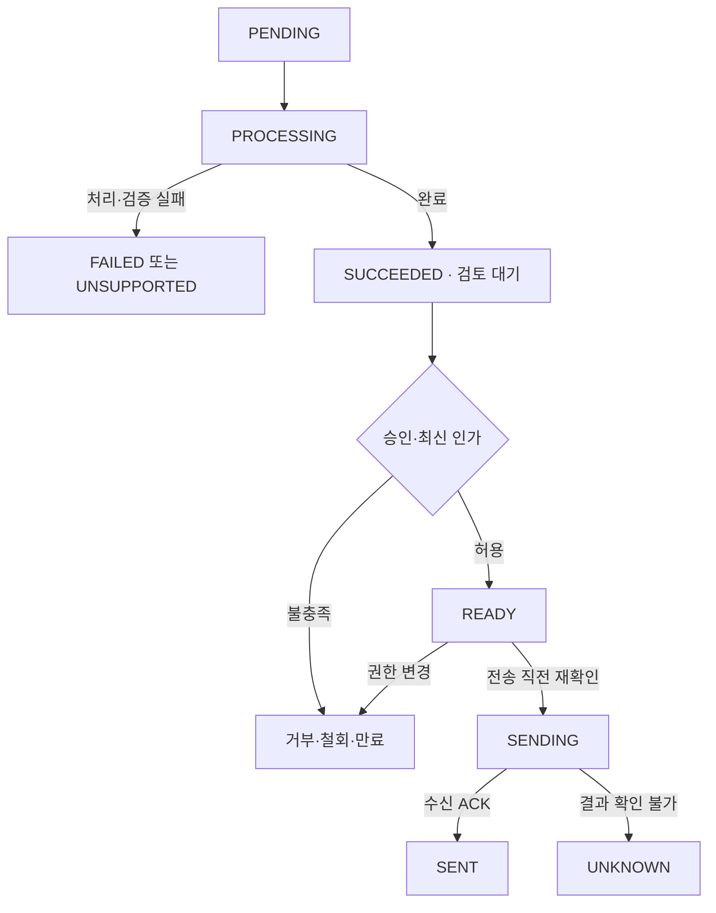

# 하이패스 OpenAI Privacy Filter 의료개인정보 보호 기능 구현계획서

문서 버전: 1.0  
작성·자료 확인일: 2026-09-06  
기준 문서: 「하이패스 OpenAI Privacy Filter 의료개인정보 마스킹·필터링 설계 프롬프트」  
적용 범위: 합성 환자·가상 병원 환경의 Highpass PoC  
문서 상태: 구현 착수에 사용할 설계안. 코드 변경·모델 실행·성능시험·배포는 이번 작성 작업에서 수행하지 않았다.

**도입 판단: 조건부 도입을 권고한다.** 송신 병원 Edge 내부에 Privacy Filter를 실행하고, 한국어 식별자 규칙·목적별 정책·DICOM 처리·반출 검증을 결합한다. 먼저 텍스트에서 AI의 추가 탐지 효과를 확인한 뒤 기존 의료영상 공유에 연결한다.

**1차 완료 목표:** 한국어 판독문·의뢰서를 처리하고, 지원 범위 안의 DICOM 처리 사본과 함께 승인된 수신처로 전달하는 흐름을 재현한다. 실패한 반출 작업은 원본 전송으로 대체되지 않아야 한다.

---

## 1. 도입 판단과 주요 결정

### 1.1 채택할 구현안

| 결정 | 채택안 | 이유·검증 조건 |
| --- | --- | --- |
| AI의 첫 적용 대상 | UTF-8 텍스트 형태의 합성 판독문·의뢰서 | 문맥 기반 탐지 효과를 측정하기 쉽고 픽셀 처리 의존성이 적다. |
| 추론 위치 | A병원 Edge의 내부 컨테이너 | 원문이 송신 병원 밖으로 나가기 전에 처리한다. |
| 실행 방식 | 공식 OPF Python 런타임 + 자체 어댑터 + FastAPI 내부 서비스 | 공식 스팬 디코딩을 유지하고 기존 Gateway에서 호출한다. |
| 개인정보 탐지 | 한국어·병원 식별자 규칙 + Privacy Filter | 명시적인 식별자와 비정형 문맥을 함께 처리한다. |
| 최종 결정 | 버전이 고정된 서버 정책과 권한 검사 | 모델 결과는 판단 입력이며 전송 권한을 발급하지 않는다. |
| 진료 경로 | 기존 인증·동의·환자 매칭을 유지 | 식별정보를 무조건 가려 환자를 잘못 연결하는 일을 방지한다. |
| 비진료 반출 | 원본에서 목적별 사본을 생성·검증 | 원본 보존과 반출 목적의 데이터 최소화를 함께 충족한다. |
| 작업 관리 | A병원 내부 PostgreSQL 작업 테이블 + 단일 Worker | 초기 운영 구성요소를 줄이고 재시작 후 작업 상태를 보존한다. |
| 최초 자원 운용 | CPU 추론 1개 프로세스부터 측정 | GPU 유무가 미확인이다. CPU 지원을 실시간 성능 보장으로 해석하지 않는다. |
| 모델 학습 | 기본 모델 평가·디코딩 조정 이후 결정 | 한국어 오류 유형을 확인하기 전 파인튜닝을 선행하지 않는다. |
| 영상 개인정보 | 태그 처리를 먼저 구현, OCR·픽셀은 제한된 확장 | 텍스트 모델의 기능과 영상 처리 기능을 구별해 검증한다. |
| 반출 승인 | MVP의 비진료 반출은 담당자 검토 후 허가 | 초기 한국어 성능과 데이터 범위가 충분히 검증되지 않았다. |

이 표의 결정은 **본 계획의 제안**이며, 하이패스 저장소에 이미 구현된 기능이라는 뜻이 아니다.

### 1.2 모델에 근거한 적용 범위

Privacy Filter는 텍스트의 개인정보 구간을 찾는 양방향 토큰 분류 모델이다. 공개 모델은 총 1.5B·활성 50M 파라미터이며, 공식 소개상 최대 입력은 128,000 토큰이다. 오픈 웨이트로 공개되었고 Apache 2.0 라이선스로 제공된다. 본 서비스의 초기 입력 한도는 이 최대치보다 작게 설정한다. [OpenAI 공식 소개](https://openai.com/ko-KR/index/introducing-openai-privacy-filter/)

기본 탐지 유형은 `private_person`, `private_address`, `private_email`, `private_phone`, `private_url`, `private_date`, `account_number`, `secret`이다. 한국어 이름과 병원 식별자의 정확도를 별도로 검증한다. 질병 정보 전체의 민감성 판단, 영상 해석, 법적 반출 판단은 모델의 기본 탐지 라벨과 별개다. [공식 모델 배포 페이지](https://huggingface.co/openai/privacy-filter)

공식 저장소는 CPU/GPU 실행을 안내한다. 확인한 패키지 메타데이터는 `opf 0.1.0`, Python `>=3.10`이며 PyTorch 등을 사용한다. 구현 기준은 Python 3.11로 제안하되, 실제 설치 시 OPF 커밋·모델 revision·의존성 버전·컨테이너 digest를 고정한다. [공식 저장소](https://github.com/openai/privacy-filter), [pyproject.toml](https://github.com/openai/privacy-filter/blob/main/pyproject.toml)

### 1.3 적용하지 않을 해석

- 모델의 기본 라벨은 시스템 프롬프트로 임의 확장하지 않는다. 병원용 분류는 외부 규칙과 정책에 추가한다.
- 빈 탐지 결과를 익명화 완료 또는 무조건 반출 허가로 해석하지 않는다.
- 공식 영어 벤치마크 수치를 한국어 의료문서의 측정값으로 사용하지 않는다.
- 이름을 지운 문서에도 건강정보와 재식별 단서가 남을 수 있다.
- 모델의 높은 점수와 완전한 익명성·법률 적합성은 서로 다른 문제다.

이는 모델 카드의 고정된 탐지 체계, 언어·도메인 차이, 의료 등 민감한 환경의 추가 검토 필요성을 반영한 적용 원칙이다. [OpenAI 모델 카드](https://cdn.openai.com/pdf/c66281ed-b638-456a-8ce1-97e9f5264a90/OpenAI-Privacy-Filter-Model-Card.pdf)

---

## 2. 현황·범위·요구사항

### 2.1 확인된 전제와 미확인 사항

| 구분 | 내용 | 본 계획에서의 처리 |
| --- | --- | --- |
| 기준 프롬프트 | 2026-09-06 작성한 14개 절의 프롬프트 전체 확인 | 설계 기준으로 사용 |
| 프로젝트 목표 | A병원 PACS 원본 유지, B병원 DICOMweb 조회, 필요 시 선택 전송 | 유지할 데이터 흐름 |
| 기존 구성요소 | Orthanc·OHIF·Gateway·Control Plane·QR·PostgreSQL을 전제로 한 설계 | 현재 구현 파일·버전은 PF-0에서 대조 |
| 모바일 | 암호화 저장·재전송 요구 존재 | 처리 사본·키 릴리스 연결을 필수 설계에 포함 |
| 저장소 상태 | 이번 작업에 저장소·브랜치·HEAD·미커밋 변경이 제공되지 않음 | 특정 파일을 이미 수정했다고 주장하지 않음 |
| 실행 환경 | 현재 Docker·DB·인증서·GPU·외부 Staging 상태 미확인 | 환경 확인을 착수 작업으로 배치 |
| 데이터 | 가상 병원·합성 환자 중심 PoC | 실제 환자 자료를 도입 전제로 삼지 않음 |
| 성능 | 모델 로딩·추론·한국어 정확도 모두 미측정 | 합격 목표와 실제 결과를 분리 |
| 일정 | 기존 10월 말 발표 목표를 고려 | 시작일·인력은 아래 일정의 계획 가정으로 명시 |

이 계획서는 검증된 코드 기준의 상세 변경 명세로 전환하기 전 단계다. 실제 저장소를 확보하면 연결 지점·경로를 확정하며, 여기 제시하는 새 경로는 **논리적인 구현 위치**다.

### 2.2 MVP와 확장

| 범위 | 포함 기능 | 완료 수준 |
| --- | --- | --- |
| P0 텍스트 | UTF-8 판독문·의뢰서, 개인정보 탐지, 마스킹 미리보기 | Unicode 경계·형식·임상 표현 보존 검증 |
| P0 정책·권한 | 이용 목적, 수신처, 원본 범위, 기관·사용자 인가 | 목적 변경과 타 기관 접근 거부 |
| P0 반출 | 작업·사본·검토·반출 상태, 만료·철회, 감사 | 검증된 동일 사본만 전달 |
| P0 DICOM | 고전적 단일 프레임 CT와 단일 프레임 Secondary Capture의 합성 샘플, Explicit VR Little Endian | 프로파일 기반 태그 처리, 참조·형식 검증, A 내부 검토 |
| P0 QR·모바일 | 일회용 티켓과 처리 사본 연결, 기존 암호화 패키지·키 릴리스 경로 연계 | 이전 승인·티켓의 목적 외 재사용 거부 |
| P1 영상 확장 | 제한된 합성 단일 프레임의 OCR·픽셀 마스킹 | 좌표 연결, 재읽기, 잔존 글자·중요 영역 훼손 검사 |
| P1 모델 개선 | 한국어 오류에 따른 파인튜닝·추론 최적화 | 분리된 평가 집합에서 개선 입증 |
| 후속 | Enhanced CT, 복수 프레임, 압축 전송 구문, MR·초음파, DICOM SR, PDF·DOCX, 얼굴 비식별 | 별도 파서·영상·형식 검증 후 지원 확대 |

지원 범위는 **AND 조건**이다. SOP Class가 맞더라도 전송 구문·프레임·픽셀 형식·프로파일 적용 가능성 중 하나가 범위를 벗어나면 `UNSUPPORTED`다. 지원 가능한 객체와 미지원 객체가 한 반출 작업에 섞이면 전체 작업을 보류한다. 일부만 보내려면 허용된 원본 범위를 명시한 새 작업을 생성한다.

태그만 처리한 DICOM의 픽셀은 자동으로 안전하다고 판정하지 않는다. MVP에서도 합성 출처 확인과 A병원 검토자의 픽셀·외형 검토를 사본 승인 조건으로 둔다. 영상 자동 비식별 기능이 완성되었다는 표시는 P1 검증 이후에만 사용한다.

### 2.3 요구사항과 완료 증거

| 요구 ID·우선순위 | 구현할 동작 | 완료 증거 |
| --- | --- | --- |
| PF-R01 · P0 | 원문 텍스트 추론은 A 내부에서 수행 | 실행 중 외부 DNS/HTTP 송신 관찰 및 차단 시험 |
| PF-R02 · P0 | 필수 식별자 규칙과 모델 결과 결합 | 동일 평가 집합의 세 방식 비교 |
| PF-R03 · P0 | 진료 조회는 기존 인가를 거쳐 동작 | AI 정지 상태의 정상·무권한 조회 시험 |
| PF-R04 · P0 | 원본 보존과 사본 생성 | 원본 해시 불변, 사본 참조·버전 기록 |
| PF-R05 · P0 | 마스킹 실패·미지원·미검증 상태의 반출 거부 | 오류 주입 및 실제 전송 바이트 점검 |
| PF-R06 · P0 | 한국어 구간 경계와 임상 표현 보존 | Unicode·숫자·단위·부정 표현 회귀 사례 |
| PF-R07 · P0 | DICOM 태그·UID·부속정보 처리 | 프로파일 점검표, 참조·재파싱·뷰어 시험 |
| PF-R08 · P0 | QR는 서버의 자료·목적·수신처와 연결 | 변조·재사용·잘못된 수신기관 시험 |
| PF-R09 · P0 | 승인과 최종 사본 바이트를 연결 | 승인 후 사본 교체·정책 변경 거부 시험 |
| PF-R10 · P0 | 원문·티켓·키가 로그에 남지 않음 | 합성 canary 기반 로그·APM·오류 검사 |
| PF-R11 · P0 | 타 기관의 작업·사본에 접근 불가 | 객체 ID 교체와 잘못된 mTLS 주체 시험 |
| PF-R12 · P0 | 재시작·중복 요청에도 작업을 추적 | Worker 중단·lease 만료·중복 ACK 시험 |
| PF-R13 · P0 | 임시자료·사본·매핑의 파기 처리 | 만료 시 조회·키 릴리스 거부와 파기 기록 |
| PF-R14 · P0 | 고정 버전으로 결과 재현 | 커밋·체크포인트·정책·평가 집합 해시 |
| PF-R15 · P1 | 영상 글자의 실제 픽셀 제거 | 재디코딩한 영상에서 대상 제거와 중요 영역 보존 |

---

## 3. 전체 구성과 책임

### 3.1 전체 데이터 흐름

실선은 요청·응답 또는 자료 전달, 점선은 권한·동의·정책 등 제어 정보다. 중앙 Control Plane에 원문 판독문·DICOM·탐지 원문을 저장하지 않는다.



B병원 Viewer는 B Edge를 통한다. A 원본 Orthanc 또는 개인정보 서비스의 주소를 B 브라우저에 직접 노출하는 경로를 만들지 않는다. A 검토자는 A 내부의 검토 경로를 이용한다. Cloud Relay가 기존에 필요하다면 Relay의 원문 지속 저장을 금지하고 기존 보안 설계를 별도로 대조한다.

### 3.2 개인정보 처리 내부 흐름



탐지·검증 서비스는 반출 권한을 직접 발급하지 않는다. 최종 반출은 기존 Gateway의 권한 검사를 통과한 전용 컨트롤러가 수행한다.

### 3.3 배포 단위

| 구성요소 | 담당 책임 | 접근 가능한 데이터 |
| --- | --- | --- |
| 기존 A Gateway + Privacy Controller | 인가, 작업 생성, 자료 범위 해석, 검토·반출 연계 | 원본 참조와 요청자 권한; 필요 시 A 내부 원문 |
| 신규 `privacy-worker` | 파싱·태그 처리·사본 생성·검증·작업 상태 갱신 | A 원본 읽기, 격리 작업 공간 쓰기 |
| 신규 `privacy-inference` | 모델 1회 로딩, 구간 탐지, 런타임 어댑터 | 요청 중인 텍스트; DB·외부 수신처 접근 없음 |
| A 내부 작업 DB | lease, 버전, 작업·검토·반출 메타데이터 | 원문 대신 참조 ID·최소 상태 |
| A 내부 매핑 저장소 | 연구 범위별 가명·UID·날짜 매핑 | 별도 암호화·권한이 적용된 추가정보 |
| 반출 저장 영역 | 검증·승인 대상으로 고정된 사본 | 버전이 있는 처리 사본 |
| 제어 서버 | 동의·수신기관·목적·권한 | 불투명 자료 참조·최소 감사 이벤트 |
| 검토 화면 | 원문/사본 비교, 검토 결과 입력 | A 담당자가 허가된 작업에 한해 조회 |

**프로세스 구성:** API 프로세스 1개와 모델 프로세스 1개를 기본으로 두고, CPU 추론 동시 실행은 1개로 시작한다. 파싱 Worker와 추론 서버를 분리해 느린 추론이 작업 상태 API를 막지 않게 한다. 여러 웹 Worker가 같은 모델을 중복 적재하지 않도록 자원 측정 후 복제한다. FastAPI는 Worker 프로세스 구성을 지원한다. [FastAPI 배포 문서](https://fastapi.tiangolo.com/deployment/server-workers/)

**DB 위치:** 기존 PostgreSQL이 중앙에만 있다면 A 내부 작업·매핑용 인스턴스가 추가로 필요하다. 원문·매핑을 중앙 DB에 넣어 이 요건을 우회하지 않는다. 기존 DB가 A 내부라면 별도 스키마·계정으로 재사용한다.

### 3.4 기존 기능과 연결할 지점

| 기존 흐름 | 연결 지점 | 변경 방식 |
| --- | --- | --- |
| 판독문·의뢰서 등록 | 서버가 내용을 보유한 직후 | A 내부 탐지 호출, 결과는 검토용으로 반환 |
| 비진료 다운로드·전송 | 원본 응답을 만드는 직전 | 처리 작업과 사본 선택을 거치게 변경 |
| QIDO/WADO 진료 조회 | 기존 정책 확인 지점 | 임의 마스킹을 추가하지 않고 기존 인가 시험 강화 |
| 선택적 PACS 전송 | 전송 대상 객체 확정 지점 | 진료 원본과 비진료 사본의 행위·권한을 구분 |
| QR 발급·교환 | 티켓 레코드 생성·소비 지점 | job·artifact·recipient·purpose·권한 버전 연결 |
| 모바일 키 릴리스 | 키 전달 직전 | 동일 사본의 검증·승인·권한 유효성 재확인 |
| 감사·오류 응답 | 구조화 로깅과 예외 처리 | 원문·티켓·키 필드 제거, 사유 코드로 대체 |

---

## 4. 상세 처리 설계

### 4.1 목적별 정책

새 반출 API의 목적 enum은 `RESEARCH / TEACHING / DEMO / AI_LOCAL`이다. 진료 조회는 기존 진료 API에서 처리하며 새 반출 API에 `CLINICAL`을 넣어 우회할 수 없다.

프로파일 레지스트리는 상위 목적 정책과 자료별 처리기를 연결한다. 예시 API의 `research-v1`은 `text-research-v1`과 `dicom-research-v1`을 포함하는 상위 정책 묶음이고, `text-demo-v1`은 텍스트 미리보기용 정책이다. 서버가 목적·자료 형식에 맞는 등록 프로파일만 선택하며, 요청자가 미등록 프로파일이나 하위 처리기의 생략을 지정할 수 없다.

| 목적 | 처리·검토 | 허가할 수신 대상 |
| --- | --- | --- |
| 기존 진료 공유 | 필요한 환자 식별·임상정보 유지, 동의·수신기관·행위 확인 | 기존 허가를 받은 진료기관 |
| RESEARCH | 직접 식별자 가명화, 목적에 불필요한 정보 제거, 날짜·희귀 사례 검토 | 사전 등록한 연구 수신처 |
| TEACHING | 직접 식별자 제거, 교육에 불필요한 날짜·기관정보 최소화 | 등록한 교육 환경 |
| DEMO | 합성 출처를 확인한 자료만 허용; 처리·실패 과정을 시연 | 프로젝트의 폐쇄형 시연 수신처 |
| AI_LOCAL | 개인정보 처리 후에도 남는 건강정보를 목적에 맞게 최소화 | 등록된 내부 AI 수신 환경 |

MVP에서는 비진료 사본 모두 검토자가 승인한다. 관리자라도 미지원 파일·파싱 실패·검증 미완료를 강제 승인하여 보낼 수 없다. 이 경우 지원 파이프라인으로 재처리해야 한다. 자동 승인 도입은 별도 평가 이후의 변경사항이다.

정책 우선순위:

1. 호출자·기관·원본 범위·수신처 인가 실패이면 즉시 거부한다.
2. 허용하지 않는 목적·형식 또는 처리 근거 미등록이면 반출을 거부한다.
3. 필수 식별자 규칙을 모델 미탐지로 해제하지 않는다.
4. 변환과 검증이 완료되기 전에는 반출을 허용하지 않는다.
5. 검토와 최신 권한 확인을 통과한 동일 사본에만 허가를 부여한다.

개별 필드의 변환 조치는 `KEEP / REMOVE / REPLACE / SHIFT / REVIEW`로 관리한다. 이 값은 작업의 진행 상태나 최종 반출 결정과 다른 필드다.

### 4.2 텍스트 탐지·치환

| 시스템 유형 | 탐지 방법 | 처리 규칙 |
| --- | --- | --- |
| PERSON | 모델 `private_person` + 허가된 자료의 이름 대조 | 역할이 불확실하면 PERSON_1 등 중립 가명 사용 |
| KR_IDENTIFIER | 주민등록번호·외국인 식별번호의 형태와 주변 필드 | 해당 식별번호 형태를 민감 후보로 처리; 체크섬 불일치만으로 허용하지 않음 |
| HOSPITAL_ID | 기관별 명시된 환자번호·접수번호 패턴 | 기관 설정과 필드 정보를 함께 사용 |
| CONTACT | 전화·이메일·주소 규칙 + 모델 결과 | 목적별 삭제 또는 유형별 대체 |
| DATE | 모델·날짜 규칙·필드명 | 생년월일·검사일·상대적 경과를 구분; 애매하면 검토 |
| SECRET | 프로젝트 토큰·키 패턴 + 모델 결과 | 사본에서 제거; 티켓·키는 애초에 본문에 넣지 않음 |
| CLINICAL_CONTENT | 임상 표현 보존 목록과 사후 차이 검사 | 진단·좌우·용량·단위·부정 표현 등의 불필요한 변환을 보류 |

처리 순서:

1. 원본 UTF-8을 strict 모드로 해석하고 고정한 입력 버전을 기록한다.
2. 원본 문자열을 유지한 채 규칙용 정규화 사본을 만든다. 정규화 문자와 원문의 위치 대응을 보존한다.
3. 모델과 규칙에서 나온 구간을 원문 코드포인트 위치로 변환한다.
4. 범위가 잘못되거나 원문 복원이 불일치하면 `OFFSET_MISMATCH`로 실패한다.
5. 겹치는 탐지 구간은 원문 덮임 범위를 합치고 탐지 근거 목록을 함께 유지한다. 필수 삭제와 보존 규칙의 충돌은 자동 보존하지 않고 검토 대상으로 만든다.
6. 정해진 replacement를 뒤쪽 구간부터 치환한다. 모델이 문서 전체를 다시 쓰지 않는다.
7. 처리 사본에서 알려진 원본 식별자·규칙 잔존·임상 표현 변화를 검사한다.
8. 원문 비교와 재검사는 A 내부에서 수행한다. 모델을 한 번 더 통과했다는 이유만으로 검증이 완성되었다고 보지 않는다.

원본과 사본 비교용 diff도 원문을 포함할 수 있으므로 일반 감사로그에 기록하지 않는다.

### 4.3 문자열 계약과 런타임 어댑터

**하이패스의 표준 위치 단위는 Unicode 코드포인트이며, 범위는 [start, end)로 정한다.** 실제 OPF 출력이 사용하는 단위는 고정할 커밋의 코드와 한글 시험으로 확인하고 어댑터에서 변환한다. JavaScript UI는 UTF-16 인덱스와 코드포인트를 혼용하지 않으며 `Array.from(text)` 등 대응표로 표시한다.

- 한글 NFC/NFD·자모·이모지·CRLF와 LF를 별도 시험한다.
- 입력 앞에 문맥용 필드명을 붙이면 prefix의 위치를 되돌리고 모델이 prefix를 식별자로 탐지한 결과를 원문에 적용하지 않는다.
- initial MVP의 8,192 토큰 초과 입력은 분할 처리하지 않고 `INPUT_TOO_LONG`으로 거부한다. 청크 경계 검증을 끝내기 전 임의 잘라서 성공 처리하지 않는다.
- 공식 스팬 디코딩을 유지하고 단순 토큰 argmax와 동일하다고 가정하지 않는다.
- 자체 코드의 `OpfAdapter.detect()`는 설계할 인터페이스명이다. 현재 OPF의 실제 공개 함수명이 확인되었다는 의미가 아니다.
- 원문은 Python 객체로 전달한다. 모델 입력을 셸 인자·환경변수에 넣지 않는다.
- 공식 JSON에 포함되는 원문·탐지 조각·복원 경고를 어댑터에서 명시적으로 다룬다. 점수를 실제로 받지 못하면 `score: null`로 반환한다. [공식 출력 스키마](https://github.com/openai/privacy-filter/blob/main/OUTPUT_SCHEMAS.md)

### 4.4 DICOM 처리 프로파일

프로파일 ID는 자체 설정인 `dicom-research-v1`로 한다. DICOM PS3.15 2026c Basic Application Level Confidentiality Profile을 기준으로, 필요한 경우 Clean Descriptors와 Modified Dates 옵션을 적용한다. 날짜 유지가 불필요한 자료에는 Modified Dates를 적용하지 않고 제거·공란 처리한다.

아래는 구현의 대표 처리표이며 전체 비식별 규칙을 대신하지 않는다. 실제 구현은 고정한 Annex E 표 전체를 검토하여 지원 SOP의 속성과 연결하고, 각 속성의 VR·필수성은 pydicom 사전과 해당 IOD 정의에 대조한다.

| 대표 속성 | 비진료 처리 사본의 조치 | 검증 |
| --- | --- | --- |
| PatientName | 개인 이름을 가명으로 대체 | 원문 이름 잔존·인코딩 검사 |
| PatientID | 연구 범위 안의 불투명 가명 | 동일 사례 일관성·다른 범위의 분리 |
| PatientBirthDate | 기본 공란; 목적상 필요한 나이 범주는 별도 검토 | 날짜·나이 조합 위험 확인 |
| AccessionNumber | 기본 공란 또는 IOD가 허용하는 대체 | 원본 접수번호 잔존 검사 |
| Study/Series/SOP Instance UID | 새 UID와 참조 매핑 생성 | 객체·참조 전체의 일관성 |
| SOP Class UID·Transfer Syntax UID | 실제 객체·인코딩에 맞게 유지 | 식별 UID와 혼동하여 변경하지 않음 |
| StudyDescription·SeriesDescription 등 | 옵션에 따라 내용 정제 또는 제거 | 모델·규칙 검사와 목적상 임상 의미 확인 |
| 기관·담당자·Private 속성 | 기본 제거·프로파일 조치; 임의 예외 보존 금지 | 중첩 Sequence까지 점검 |
| Original Attributes·파일 메타·아이콘 | 원문 잔존 제거·재생성 | 우회 저장된 식별정보 검사 |

원본을 덮어쓰지 않으며 중첩 속성·UID 참조·파일 메타·비식별 기록을 포함해 처리한다. 지원 IOD의 필수값을 공란으로 만들어 형식을 깨뜨리지 않는다. pydicom의 읽기·쓰기 성공은 IOD 적합성 검증과 다르다. [DICOM Annex E](https://dicom.nema.org/medical/dicom/current/output/chtml/part15/chapter_e.html), [pydicom 처리 예제](https://pydicom.github.io/pydicom/stable/auto_examples/metadata_processing/plot_anonymize.html)

**날짜 변환:** 목적상 필요한 자료에만 연구 범위·환자 가명에 연결된 일정한 오프셋을 사용한다. 예시 기본 오프셋 범위는 ±180일 이내의 0이 아닌 값으로 제안하되, 이는 보안 보장 수치가 아니다. 검사 간 간격, 자정 경계, 날짜·시각의 관계를 함께 시험한다. 범위를 벗어난 날짜 또는 생년월일 유추 위험은 보류한다. 실제 오프셋은 반출 매니페스트에 기록하지 않는다. DICOM의 Modified Dates 옵션은 필요한 시간 관계 보존과 변환 방법 기록을 요구한다. [DICOM 날짜 옵션](https://dicom.nema.org/medical/dicom/current/output/chtml/part15/sect_e.3.6.html)

**가명·UID 매핑:** 임의 가명을 생성한 뒤 A 내부의 별도 보호 영역에 원본 매핑을 저장한다. 연구 프로젝트와 수신 목적별 매핑 범위를 지정하고 전역 가명을 공유하지 않는다. 매핑을 찾기 위한 HMAC 키와 암호화 키는 구분하며 키 없이 계산한 원문 해시를 가명으로 사용하지 않는다. 가명 매핑의 존재가 연구 자료를 자유롭게 재식별할 권한을 뜻하지 않는다.

### 4.5 영상 픽셀과 미지원 자료

MVP의 태그 처리 파이프라인은 픽셀을 원문 그대로 보존한다. 해당 사본은 **픽셀 검토 완료**를 별도로 요구하며, `BurnedInAnnotation=NO`만으로 통과시키지 않는다.

P1 자동 처리 순서는 다음과 같다.

1. 지원되는 단일 프레임 합성 영상을 디코딩한다.
2. 로컬 OCR의 글자·좌표·전처리 변환값을 확보한다.
3. OCR 문자열의 탐지 구간을 해당 프레임 좌표로 되돌린다.
4. 중요한 임상 표시와 겹치면 검토로 넘긴다.
5. 표시용 overlay가 아니라 저장 픽셀을 바꾸어 사본을 만든다.
6. 재디코딩·재검사하고 측정값·좌우 표시·합성 병변 영역의 손상을 확인한다.

단일 프레임 성공으로 다중 프레임을 허용하지 않는다. 얼굴·외형 재식별은 OCR의 적용 밖이며, 머리·안면 등 별도 검토가 필요한 자료는 자동 반출 대상에서 제외한다. [Clean Pixel Data](https://dicom.nema.org/medical/dicom/current/output/chtml/part15/sect_e.3.html), [시각적 식별요소 처리](https://dicom.nema.org/medical/dicom/current/output/chtml/part15/sect_e.3.2.html)

### 4.6 초깃값·성능·네트워크

다음 값은 **합성 PoC의 제안 초깃값**이다. 공식 모델 요구 사양·법정 기간·실측값이 아니다. PF-1에서 측정하고 변경 근거를 남긴다.

| 설정 | 초깃값 | 이유·조정 규칙 |
| --- | --- | --- |
| 추론 프로파일 | 4 vCPU·16 GiB RAM, CPU 사용 | 작은 프로파일부터 적재·최대 메모리 확인; 장비에 맞게 축소·조정 |
| 모델 프로세스·동시 추론 | 각각 1개 | 중복 적재와 CPU 경합 방지 |
| 동기 텍스트 | 최대 2,048 토큰·32 KiB, 10초 deadline | 작은 문서 미리보기용; 한도는 모두 만족 |
| 비동기 텍스트 | 최대 8,192 토큰·256 KiB, 추론 60초 deadline | 긴 문서용; 초과는 명시적 거부 |
| 외부 작업 한도 | job당 20 MiB·100개 객체·전체 처리 10분 | 합성 실증 범위; 실제 CT 전체 검사 크기 지원 주장 금지 |
| 대기 큐 | 기관별 10개 | 자원 고갈 방지; 초과는 429 |
| job lease·heartbeat | 60초·10초 | 처리 중단 탐지; heartbeat는 추론과 독립 수행 |
| 자동 재시도 | 재시도 가능한 실패에 한해 최대 2회 | 권한·형식·구간 오류는 자동 재시도하지 않음 |
| warm 추론 목표 | 2,048 토큰 이하 p95 5초 | 초과하면 동기 기능을 줄이고 비동기 화면 사용 |
| 비동기 추론 목표 | 8,192 토큰 이하 p95 30초 | 시간·메모리 미달 시 입력 한도 조정 또는 GPU 검토 |

더 작은 실장비에서 동기 목표가 충족되지 않아도 원본 자동 전송으로 대체하지 않는다. 비동기 작업의 진행 상태를 보여준다. 모델 적재가 실패하면 readiness를 실패시켜 새 작업 수락을 중단한다.

timeout은 HTTP 응답만 끊고 추론을 무한히 남겨두는 방식으로 구현하지 않는다. 취소할 수 없는 추론이 deadline을 넘으면 해당 attempt를 실패시킨 뒤 추론 프로세스를 격리·재기동하고, readiness 회복 전 새 호출을 보류한다. 늦게 반환된 결과는 attempt·lease 검사로 폐기한다. 제어 서버의 최신 권한을 확인할 수 없으면 새 반출을 보류하며, 기존 진료 세션은 기존에 검증된 인가 정책에 따라 처리한다.

모델·패키지는 준비 단계에서 취득하고 해시를 확인한다. 실행 시 checkpoint는 읽기 전용으로 마운트하며 외부 다운로드를 차단한다. `privacy-inference`는 A 내부 호출만 수신하고 PACS·DB·인터넷에 접속할 권한을 주지 않는다. 네트워크 통제가 실제로 동작하는지 빈 캐시·잘못된 checkpoint·원격 수신처 입력으로 시험한다.

메모리의 원문은 요청 종료 후 참조를 해제하고 crash dump·본문 추적을 비활성화한다. Python 객체의 완전한 즉시 소거를 보장한다고 표현하지 않는다.

작업 중 평문 임시파일은 A 내부의 tmpfs 또는 암호화된 제한 영역에만 두고 일반 백업에서 제외한다. 여러 작업이 같은 임시 경로를 공유하지 않게 하고, 종료·재시작 시 잔존 파일을 정리한다.


---

## 5. 인터페이스·상태·데이터 구조

### 5.1 내부 API 목록과 접근권한

아래 API는 **하이패스가 구현할 내부 계약**이며 OpenAI의 호스팅 API가 아니다. Gateway가 mTLS 서비스 신원과 위임된 사용자 권한을 검증하고 원본 기관을 결정한다. JSON의 `org_id`나 `actor_id`를 신뢰해 권한을 정하지 않는다.

| API | 필요한 권한·주체 | 결과 |
| --- | --- | --- |
| POST `/internal/privacy/text-inspections` | `privacy:inspect`; 허가된 A Gateway | 동기 탐지·마스킹 미리보기 |
| POST `/internal/privacy/export-jobs` | `privacy:export:create`; 자료 접근권한이 있는 요청자 | 비동기 처리 job 생성 |
| GET `/internal/privacy/export-jobs/{jobId}` | 해당 작업의 조회권한 | 처리 상태와 최소 요약 |
| POST `/internal/privacy/export-jobs/{jobId}/reviews` | `privacy:review`; A 검토 담당자 | 고정 사본의 승인·반려 |
| POST `/internal/privacy/export-jobs/{jobId}/release` | `privacy:release`; 최종 반출 권한 | 전송 작업 접수 |
| POST `/internal/privacy/export-jobs/{jobId}/cancel` | 생성자 또는 승인된 운영자 | 미전송 작업 중단·권한 철회 |
| GET `/internal/privacy/health/ready` | 내부 운영 서비스 | 모델·정책·필수 의존성 준비 상태 |

B기관의 일반 Viewer 사용자에게 `privacy:review`나 원문 비교 권한을 부여하지 않는다. MVP의 검토자는 요청자와 다른 계정으로 지정한다. 한 사람이 두 시연 계정을 쓰는 경우 실제 조직의 업무 분리 검증으로 보고하지 않는다.

모든 생성·검토·반출 요청은 `Idempotency-Key`를 요구한다. 같은 기관·호출자·경로·키와 같은 본문은 기존 결과를 반환하고, 본문이 다르면 409로 거부한다.

### 5.2 텍스트 요청·응답 예시

아래 JSON은 **합성 데이터 기반 계약 예시**이며 실제 모델 출력이 아니다. 이 API는 A 내부에서만 원문을 받고, 응답 본문을 access log에 기록하지 않는다.

```json
{
  "request_id": "req_demo_001",
  "purpose": "DEMO",
  "profile_id": "text-demo-v1",
  "content_type": "text/plain; charset=utf-8",
  "text": "환자: 가상환자A. 우측 폐 결절 5 mm. 발열 없음."
}
```

```json
{
  "request_id": "req_demo_001",
  "inspection_status": "SUCCEEDED",
  "policy_decision": "REVIEW_REQUIRED",
  "offset_unit": "unicode_codepoint",
  "end_exclusive": true,
  "findings": [
    {
      "start": 4,
      "end": 9,
      "system_type": "PERSON",
      "model_label": "private_person",
      "sources": ["model"],
      "score": null,
      "replacement": "<PERSON_1>"
    }
  ],
  "redacted_text": "환자: <PERSON_1>. 우측 폐 결절 5 mm. 발열 없음.",
  "quality": {
    "offsets_valid": true,
    "decoded_mismatch": false,
    "clinical_change_flags": []
  },
  "versions": {
    "model": "openai/privacy-filter@<PINNED_REVISION>",
    "runtime": "<PINNED_OPF_COMMIT>",
    "rules": "rules-ko-v1",
    "policy": "text-demo-v1"
  },
  "release_eligible": false
}
```

`score: null`은 이 계약에서 사용할 검증된 모델 점수를 제공하지 않았음을 뜻한다. `SUCCEEDED`는 해당 검사를 마쳤다는 의미이고, `release_eligible: false`는 이 미리보기가 반출 승인을 대체하지 않는다는 의미다. 브라우저 표시용 replacement와 실제 반출 사본은 같은 확정 규칙으로 생성한다.

### 5.3 반출 작업 생성

기존 원본 등록 기능이 반환한 **자료 참조와 고정 버전**을 입력한다. 사용자가 지정한 파일 경로·임의 URL을 직접 읽지 않는다. Study 수준의 요청이라면 A Gateway가 권한 있는 SOP Instance 목록으로 확장하여 manifest를 고정한다.

```json
{
  "purpose": "RESEARCH",
  "recipient_id": "recipient_demo_b",
  "approved_use_ref": "use_demo_001",
  "profile_id": "research-v1",
  "source_artifacts": [
    {
      "artifact_ref": "src_demo_report_01",
      "version": "1"
    },
    {
      "artifact_ref": "src_demo_study_01",
      "version": "1"
    }
  ]
}
```

`approved_use_ref`는 서버에 등록한 목적·자료 범위·수신처·처리 근거의 참조다. 연구용 가명 범위도 이 참조에서 결정하며 요청자가 전역 환자 매핑을 임의로 선택할 수 없다.

202 응답 예시:

```json
{
  "job_id": "job_demo_001",
  "job_status": "PENDING",
  "policy_decision": "TRANSFORM_REQUIRED",
  "review_status": "PENDING",
  "release_status": "NOT_READY",
  "status_path": "/internal/privacy/export-jobs/job_demo_001"
}
```

검토 요청은 서버가 생성한 `artifact_id`, `artifact_version`, `manifest_digest`, 검토 결정과 사유 코드를 포함한다. 체크박스만으로 승인하지 않고 권한 있는 검토자의 인증·현재 정책·검증 보고서 일치를 확인한다.

반출 요청 예시:

```json
{
  "artifact_id": "artifact_demo_001",
  "artifact_version": 1,
  "review_id": "review_demo_001",
  "expected_manifest_digest": "<DIGEST_RETURNED_BY_SERVER>"
}
```

수신처·목적을 반출 요청에서 바꾸지 않는다. 변경이 필요하면 새 작업·새 승인으로 처리한다. 202는 전송 접수이며, 성공 여부는 `release_status`와 수신 ACK로 확인한다.

### 5.4 상태 모델

| 상태 영역 | 값 | 의미 |
| --- | --- | --- |
| job_status | PENDING, PROCESSING, SUCCEEDED, FAILED, UNSUPPORTED, CANCELLED | 자료 처리·검증의 수행 결과 |
| current_stage | RESOLVE, EXTRACT, DETECT, TRANSFORM, VALIDATE, FINALIZE | PROCESSING 중 작업 위치 |
| policy_decision | UNDECIDED, TRANSFORM_REQUIRED, REVIEW_REQUIRED, ALLOW, DENY | 현재 정책 평가 결과 |
| review_status | PENDING, APPROVED, REJECTED, STALE | 특정 사본에 묶인 검토 결과 |
| release_status | NOT_READY, READY, SENDING, SENT, UNKNOWN, REVOKED, EXPIRED | 반출 가능·전송·철회 상태 |
| artifact_state | QUARANTINED, VALIDATED, EXPIRED, PURGED | 저장된 사본의 검증·수명주기 |



그림의 “SUCCEEDED · 검토 대기”는 서로 다른 상태 필드의 조합이다. 사본을 수정하면 버전을 올리고 기존 review는 STALE, release는 NOT_READY로 만든다. 필수 검증이 실패한 job은 사람의 승인만으로 READY가 될 수 없다.

**반출의 필수 조건**

```text
job_status == SUCCEEDED
AND artifact_state == VALIDATED
AND review_status == APPROVED
AND policy_decision == ALLOW
AND approved_artifact_version == current_artifact_version
AND approved_manifest_digest == actual_manifest_digest
AND authorization_and_recipient_valid_now
AND source_scope_and_approved_use_still_valid
AND grant_not_expired_or_revoked
```

위 식은 조건 설명용이다. API가 보내는 `release_eligible` 불리언만 신뢰하지 않고 서버에서 매번 다시 계산한다.

### 5.5 오류 계약

| 상황 | HTTP·사유 코드 | 처리 |
| --- | --- | --- |
| 인증 없음·위임 실패 | 401 AUTH_REQUIRED | 처리 시작 전 거부 |
| 권한·목적·수신처 부적합 | 403 POLICY_DENIED | 원문을 추론 서비스에 보내지 않음 |
| 타 기관 또는 존재하지 않는 객체 | 404 RESOURCE_NOT_FOUND | 객체 존재 여부 노출 최소화 |
| 중복 키의 다른 요청·승인 버전 불일치 | 409 STATE_CONFLICT | 새 결과 생성·반출 금지 |
| 입력 크기 초과 | 413 INPUT_TOO_LARGE | 잘라서 처리하지 않음 |
| 미지원 형식 | 415 UNSUPPORTED_MEDIA_TYPE | job은 UNSUPPORTED, 사본은 격리 |
| 구간 복원·내용 형식 오류 | 422 OFFSET_MISMATCH / INVALID_CONTENT | 자동 승인 금지, 원문 오류 구절 미반환 |
| 큐 초과 | 429 QUEUE_FULL | 재시도 가능한 시점 안내 |
| 모델 미준비·의존성 장애 | 503 MODEL_UNAVAILABLE | 새 작업 보류 |
| 동기 deadline 초과 | 504 MODEL_TIMEOUT | 해당 응답을 성공으로 기록하지 않음 |

비동기 job 생성은 202 이후 처리 중 실패할 수 있다. 이때 GET은 200으로 `job_status: FAILED`와 안전한 오류 코드를 반환한다. GET 자체의 HTTP 200을 처리 성공으로 판단하지 않는다.

오류 예시:

```json
{
  "request_id": "req_demo_002",
  "inspection_status": "FAILED",
  "policy_decision": "DENY",
  "error": {
    "code": "MODEL_TIMEOUT",
    "retryable": true
  },
  "release_eligible": false
}
```

### 5.6 작업 DB와 매핑

| 논리 테이블 | 주요 필드 | 제약 |
| --- | --- | --- |
| privacy_jobs | job_id, source_org_id, creator_ref, purpose, recipient_ref, approved_use_ref, input_manifest_digest, job_status, current_stage, policy_version, model_bundle_ref, attempt, lease_owner, lease_until, expires_at | job_id PK; 기관·호출자·요청 키의 유일성 |
| privacy_job_inputs | job_id, source_ref, source_version, source_digest | job FK; 동일 원본 버전 중복 금지 |
| privacy_artifacts | artifact_id, job_id, version, storage_ref, manifest_digest, artifact_state, validation_ref, created_at, expires_at | artifact_id·version 유일; 원본 참조와 혼용 금지 |
| privacy_reviews | review_id, artifact_id, artifact_version, reviewer_ref, decision, policy_version, manifest_digest, reviewed_at | 사본 버전·digest가 일치하는 승인만 유효 |
| privacy_releases | release_id, artifact_id, version, recipient_ref, grant_generation, release_status, transfer_id, ack_at | 수신 대상·사본·transfer_id 연결; 중복 ACK 멱등 처리 |
| privacy_mapping | mapping_scope_id, kind, lookup_mac, encrypted_payload, pseudonym, key_version | scope·kind·lookup_mac 유일; 일반 API 계정 접근 불가 |
| privacy_policy_versions | version_id, config_digest, active, allowed_purposes, compatibility_ref | 변경은 새 버전; 과거 버전 불변 |
| privacy_audit_outbox | event_id, org_ref, job_id, event_type, reason_code, actor_ref, versions, happened_at, delivered_at | 이벤트 ID 유일; 원문·토큰 값 금지 |

실제 DDL은 기존 키 타입·migration 도구와 맞춘다. 모든 기관 종속 FK/조회 조건에 기관 경계를 포함하고, 가능하면 PostgreSQL RLS를 보조 통제로 적용한다. UUID 추측이 어렵다는 이유만으로 객체별 인가를 생략하지 않는다.

매핑 payload에는 원본 식별값·날짜 오프셋처럼 복원 가능한 추가정보를 암호화해 넣는다. lookup_mac은 원문 검색용 보조 식별자이며 외부 API·일반 로그에 내보내지 않는다. 키는 소스·DB와 분리한 제한된 secret 파일로 제공하는 PoC 구조를 사용하고, 기관 운영 전환 시 키 관리 시스템과 권한 분리를 별도로 확정한다.

**작업 획득:** Worker는 짧은 트랜잭션에서 `FOR UPDATE SKIP LOCKED`로 처리할 job을 선점하고 lease를 기록한다. 추론 동안 DB 잠금을 계속 보유하지 않는다. 완료 기록은 동일 lease_owner·attempt인 경우에만 반영한다. PostgreSQL은 SKIP LOCKED를 큐 형태 접근에 사용할 수 있도록 제공한다. [PostgreSQL 16 SELECT](https://www.postgresql.org/docs/16/sql-select.html)

**장애 복구:** heartbeat와 추론 호출을 분리한다. lease가 만료되면 이전 Worker의 결과를 fencing 검사로 폐기한다. 이미 실패한 attempt의 파일은 공개하지 않고 격리한 뒤 파기한다. 재시도한 결과도 새 검증을 거친다.

### 5.7 검증과 전송 사이의 변경 방지

1. 원본 manifest에 대상 객체·버전·digest를 고정한다.
2. 처리된 파일·텍스트·부속정보 목록을 사본 manifest로 만든다.
3. 검증한 사본을 반출 컨트롤러 소유의 고정 버전 저장 영역으로 승격한다. 처리 Worker가 승인된 버전을 덮어쓸 수 없게 한다.
4. 검토는 사본 버전·manifest digest·정책 버전에 묶는다.
5. 반출 직전 사본, 승인, 현재 권한, 수신기관, 동의·목적의 유효성을 확인한다.
6. 동일 트랜잭션에서 반출권의 사용 상태와 감사 이벤트를 기록하고, 별도 전송 루틴이 고정된 바이트를 보낸다.
7. 수신자는 transfer_id와 사본 digest로 중복 전송을 식별하고 ACK를 반환한다.

DB 커밋과 네트워크 수신은 하나의 원자적 작업으로 보장할 수 없다. ACK가 유실되면 UNKNOWN으로 기록하고 수신자 상태를 조회한다. 새 티켓으로 무조건 재전송하지 않는다. 전송 재개가 필요하면 동일 수신자·사본의 허가된 전송 세션에서 처리한다.

전송 중 철회는 아직 보내지 않은 데이터와 향후 키 릴리스를 차단하는 정책으로 처리한다. 이미 받은 평문·이미 전달된 복호화 키를 소급 회수했다고 주장하지 않는다.

### 5.8 QR·모바일 패키지

**티켓 저장:** QR에는 무작위 256비트 불투명 티켓을 제안하며 서버는 원문 대신 해시와 서버 레코드를 보관한다. 발급 계정·요청자는 서버에서 확인한다. 티켓 entropy와 기간은 본 PoC 제안이며 기존 규격이 있다면 실제 동등성과 호환성을 확인한다.

**기간 초깃값:** 미사용 티켓은 최대 5분, 온라인 전송 세션은 최대 15분으로 제안한다. 실제 유효기간은 사본 만료·동의·권한 만료 중 가장 이른 시점 이하로 제한한다. 티켓 교환은 한 번만 가능하고 전송 중 재개는 별도의 인증된 세션에 연결한다.

**서버 연결 필드:** ticket_hash, job_id, artifact_id, artifact_version, purpose, recipient_ref, approved_use_ref, consent_or_basis_version, issued_at, expires_at, consumed_at, revoked_at. 필요한 원본 범위와 처리 사본의 관계는 A 내부에서 해석한다.

**패키지 순서:** 사본 생성 → 검증 → 고정 버전 → 검토 승인 → 재인가 → 인증된 암호화 패키지 생성 또는 봉인 → 지정 수신자에 전달 → 키 릴리스 시 재인가.

- 기존 모바일 패키지 규격이 있다면 암호 방식을 새로 발명하지 않고 해당 검증된 규격에 사본 버전·승인 연결을 추가한다.
- 패키지의 출처·무결성·수신자 바인딩은 암호 라이브러리와 기존 인증 체계로 검증한다.
- QR나 외부 manifest에 환자 이름·검사 UID 원문·복호화 키를 넣지 않는다.
- 진료용 원본 패키지와 연구용 사본 패키지는 타입과 권한 범위를 구별한다.
- 스마트폰 장기 보관·오프라인 전달이 기존에 구현되지 않았다면 이번 필수 작업은 **온라인 암호화 패키지 핸드오프와 키 릴리스 검증**까지다. 완전한 오프라인 재전송은 후속 범위로 명시한다.
- 모바일 평문 복사와 화면 캡처를 서버의 마스킹·만료 기능으로 완전히 통제할 수 있다고 표현하지 않는다.

### 5.9 보관·파기·감사

다음 기간은 **합성 PoC의 운영 초깃값**이다. 실제 환자 데이터의 법정 기록 보존기간이나 기관 보관정책을 대체하지 않는다.

| 자료 | PoC 보관 정책 | 통제 |
| --- | --- | --- |
| 원본 PACS | 기존 보관정책 유지 | 개인정보 처리 Worker는 읽기만 수행 |
| 요청 중 텍스트 | 요청 동안 메모리 보유 | 본문 로그 금지, 참조 해제, crash dump 제한 |
| 작업 임시파일 | 종료 후 15분 이내 정리; 비정상 잔존은 생성 후 1시간 기준 청소 | A 내부 격리, 허용량 제한 |
| 반출 사본·승인 | 기본 24시간 | 만료 시 다운로드·키 릴리스 금지 |
| PoC 매핑 | 등록된 사용 범위의 기간까지; 단일 시연의 기본값은 24시간 | A 내부 암호화, 사본과 분리; 연속 연구의 연결 기간은 별도 설정 |
| 일반 시연 운영로그 | 기본 90일 | 원문 없이 최소 필드; 접근 제한 |
| 법 적용 대상 가명처리 기록 | 운영 적용 시 별도 법정·기관 정책 | PoC의 24시간·90일 규칙을 적용하지 않음 |

Worker 또는 추론 장애 시에도 정리 작업은 별도로 실행한다. 승인 대기 중 만료되면 승인할 수 없고, 원본에서 새 작업을 만든다. 만료 정책 때문에 이미 제공한 수신기관의 진료기록을 임의 삭제하지 않는다.

감사 이벤트는 JOB_CREATED, PROCESSING_FAILED, VALIDATION_PASSED, REVIEW_APPROVED, REVIEW_REJECTED, RELEASE_CLAIMED, RELEASE_ACKED, RELEASE_REVOKED, ARTIFACT_PURGED 등을 사용한다. 모델 입력·원본 식별자·token·키·예외 본문은 기록하지 않는다. 일반 검토 사유는 코드 중심으로 입력하고 자유 텍스트에 개인정보를 적지 않도록 UI와 서버에서 제한한다.


---

## 6. 검증 계획·평가 기준·시연

### 6.1 데이터 구성

| 평가 자료 | 계획 수량 | 분리·검수 방식 |
| --- | --- | --- |
| 한국어 중심 텍스트 | 합성 600건: 개발 240·검증 120·최종 시험 240 | 환자·템플릿·기관 양식 단위로 분리 |
| Unicode·치환 회귀 자료 | 100건 | NFC/NFD·이모지·줄바꿈·겹침·경계 오류 |
| DICOM 합성 자료 | 20개 Study·총 60개 Instance | 지원 12개 Study·36개 Instance, 실패·미지원 8개 Study·24개 Instance |
| 권한·반출·장애 사례 | 아래 PF-T01~PF-T20 | 정상·부정·재시작·중복 처리 |
| P1 OCR 자료 | 합성 단일 프레임 40개 | 글자 위치·색·회전·영역 겹침의 정답 좌표 |

수량은 확보된 데이터가 아닌 작성 계획이다. 텍스트 600건은 현실적인 합성 양식으로 생성하며, 합성 여부는 데이터 관리 메타데이터에 표시한다. 모든 본문에 “가상”이라는 단어를 반복하여 모델이 쉽게 구별하는 데이터만 만들지 않는다.

**정답:** 개인정보 구간·유형·처리 조치와 보존해야 할 임상 표현을 라벨링한다. 생성 코드가 부여한 라벨을 사람이 검토하고, 최종 시험의 모든 고위험 식별자 및 전체 자료의 20% 이상은 두 번째 검토자가 확인한다. 판단이 갈린 사례는 최종 시험 전에 정답을 확정한다.

**분포:** 한국어 이름·보호자/의료진, 병원번호·식별번호 형태, 연락처·주소, 날짜, 영어 혼용, OCR 오류, 개인정보 없는 문서, 의료 용어 오탐 사례를 포함한다. 각 필수 평가 유형은 최종 시험에 최소 30개 정답 구간 또는 음성 사례를 확보한다. 문서는 다중 유형을 포함할 수 있다.

**누수 방지:** 개발·검증에 사용한 양식의 이름만 바꿔 최종 시험에 넣지 않는다. 최종 시험은 잠근 뒤 반복 튜닝에 사용하지 않는다. 최종 시험을 보고 모델·정책을 수정하면 다음 판정에는 새로운 독립 시험 자료가 필요하다.

임상 표현 보존은 합성 문장의 정확한 문자열·수치·관계에 대한 검증이다. 실제 전문의가 확인한 진단 유효성 평가로 표현하지 않는다.

### 6.2 비교 실험과 AI 기여도

| 실험 | 텍스트 탐지 구성 | 비교의 기준 |
| --- | --- | --- |
| A | 규칙 단독 | 명시적 패턴의 기준 성능 |
| B | Privacy Filter 단독 | 문맥 기반 탐지와 한국어 취약점 |
| C | 규칙 + Privacy Filter | 추가 탐지 효과와 오탐·지연 변화 |

세 실험은 같은 입력·정답·평가 스크립트와 같은 후처리 정책을 사용한다. 모델 효과를 비교하는 동안 정책을 다르게 바꾸지 않는다. DICOM 구조화 태그 처리와 사람의 검토가 더해진 **최종 시스템 평가는 별도로 보고**한다.

정량 정의:

- exact-span TP는 시작·끝·정규화된 시스템 유형이 정답과 모두 일치한 경우다.
- Precision = TP / (TP + FP), Recall = TP / (TP + FN).
- F1 = 2 × Precision × Recall / (Precision + Recall).
- 구간 일부만 맞는 경우는 정확한 구간 검출 성공으로 세지 않는다. 부분 덮임은 보조지표로 따로 보고한다.
- 직접 식별정보 잔존율 = 처리 사본에 정답 식별정보가 남은 문서 수 / 식별정보가 포함된 평가 문서 수.
- 필수 임상정보 보존율 = 보존된 필수 표현 수 / 정답상 보존해야 할 필수 표현 수.
- 추가 탐지율 = 규칙 단독의 FN 중 결합 방식이 TP로 바꾼 수 / 규칙 단독 FN 수. 분모가 0이면 N/A로 표시한다.
- 자동 처리 완료율은 지원 범위의 정상 입력 중 처리·검증에 성공한 비율로 계산한다. 모두 차단하여 누출 0건을 만드는 결과와 구별한다.

운영 중 반출되지 않은 **평가용 미승인 사본**을 먼저 측정하여 AI·규칙의 미탐을 확인한다. 사람이 고친 결과만 평가해 모델 성능을 부풀리지 않는다.

### 6.3 잠정 합격 기준

다음은 PoC의 제안 기준이다. 법정 수치나 의료환경에서 검증된 안전 기준이 아니다. PF-0에서 승인할 평가계획에 고정하고, 시험 후 통과를 위해 기준을 낮추지 않는다.

| 평가 항목 | 잠정 목표 | 미달 시 조치 |
| --- | --- | --- |
| 텍스트 exact-span | micro Recall ≥98%, Precision ≥95%; 유형별 수치 병기 | 오류 분석·규칙/디코딩 개선, 반출 자동 승인 도입 보류 |
| 필수 식별자 회귀 사례 | 지정 사례의 미탐지·잔존 0건 | P0 미완료; 배포 후보에서 제외 |
| AI 추가 기여 | 규칙 FN의 30% 이상 보완, Precision 하락 2%p 이내 | AI 도입 효과 미입증으로 표시; 해당 범위 축소 또는 개선 |
| 임상정보 보존 | 전체 필수 표현 ≥99%, 중요 좌우·부정·용량·단위 사례 오류 0건 | 검토 보류 조건 강화·치환 수정 |
| 정상 입력 처리 | 지원 범위의 정상 입력 90% 이상 처리·검증 완료 | 과도한 차단·미지원 범위 재검토 |
| 반출 안전 불변조건 | PF-T의 필수 거부·정상 허용 기대값 모두 일치 | P0 미완료 |
| 로그·비밀정보 | 정해진 canary의 금지 채널 검출 0건 | 로깅·오류 처리 수정 |
| DICOM | 지원 fixture 전부 참조·필수 형식·뷰어 시험 통과 | 해당 형식 반출 비활성화 |
| 태그 전용 경로 | 픽셀 해시의 불필요한 변화 0건 | 변환 파이프라인 수정 |
| 성능 | 4.6절 목표와 timeout·큐 정책 충족 | 비동기 전환·한도 조정·자원 재평가 |

“0건”에는 시험 수와 입력 분포를 함께 적는다. 240건의 합성 시험에서 누출이 없었다는 결과를 전체 의료문서에서 오류가 없다는 보장으로 사용하지 않는다. 한국어 인명 등 유형별 분모가 작은 경우 해당 불확실성을 별도로 표시한다.

### 6.4 필수 시험 사례

| 시험 ID | 시나리오 | 기대 결과 |
| --- | --- | --- |
| PF-T01 | 올바른 진료 권한·환자·Study로 조회 | 기존 진료 경로 정상, 환자 정보 임의 변환 없음 |
| PF-T02 | AI 프로세스 중단 후 진료 정상·무권한 조회 | 기존 정책대로 정상 요청 허용·무권한 거부 |
| PF-T03 | 합성 한국어 판독문·의뢰서 처리 | 식별자 처리, 임상 표현 보존, 검토 대기 |
| PF-T04 | 모델 미탐지 + 병원번호 필수 규칙 탐지 | 규칙 조치를 모델이 해제하지 않음 |
| PF-T05 | 개인정보가 없는 정상 문서 | 과도한 마스킹 없이 처리; 승인 조건 유지 |
| PF-T06 | 이름과 의학용어가 혼동되는 문장 | 오탐을 측정하고 충돌 시 검토 |
| PF-T07 | NFC/NFD·이모지·줄바꿈·구간 겹침 | 원문 위치 정확; 잘못된 위치면 실패 |
| PF-T08 | 모델 timeout·적재 실패·빈 체크포인트 | 실패 상태, 원본 대신 전송하는 동작 없음 |
| PF-T09 | 미지원 SR·PDF·복수 프레임·혼합 Study | 전체 반출 보류, 부분 성공을 전체 성공으로 기록하지 않음 |
| PF-T10 | 중첩 태그·원본 속성·Private 정보 | 지원 범위에서 정제 또는 안전한 거부 |
| PF-T11 | UID 참조·날짜 관계·한국어 DICOM | 관계·형식 검증; 불일치면 반출 보류 |
| PF-T12 | 픽셀에 이름이 있지만 태그가 NO인 영상 | 태그만으로 통과하지 않고 검토 또는 P1 처리 |
| PF-T13 | 타 기관 job·artifact ID 대입 | 404 또는 정책상 거부, 원문·상태 누출 없음 |
| PF-T14 | RESEARCH를 CLINICAL로 바꿔 우회 | 새 API에서 거부; 기존 진료 API도 별도 권한 필요 |
| PF-T15 | 승인 후 파일·버전·정책·수신처 변경 | 승인 무효 또는 409, 이전 승인으로 전송 불가 |
| PF-T16 | QR 만료·재사용·다른 수신기관 | 교환·키 릴리스 거부 |
| PF-T17 | 작업 중 권한 철회·사본 만료 | 반출·키 릴리스 중단, 상태와 감사 일치 |
| PF-T18 | Worker 중단·lease 만료·중복 요청·ACK 유실 | 멱등 처리·fencing·UNKNOWN 추적 |
| PF-T19 | 원문·가상 토큰 canary를 넣고 정상·오류 실행 | 로그·APM·예외·파일명·QR에 금지 값 없음 |
| PF-T20 | 처리·승인·수신 ACK가 모두 정상 | 고정한 사본만 수신, 원본 불변, 이벤트 연결 |

P1은 PF-T12를 확장하여 OCR의 위치 복원·실제 픽셀 변경·재읽기·중요 영역 보존을 별도 시험한다.

### 6.5 현재 측정 현황과 증거 형식

| 항목 | 현재 상태 | 구현 단계에서 제출할 증거 |
| --- | --- | --- |
| 한국어 Precision·Recall·F1 | 미측정 | 고정 평가 집합 해시와 confusion/error 목록 |
| CPU/GPU 시간·메모리 | 미측정 | 장비·입력 길이·동시성·모델 revision별 결과 |
| DICOM 재파싱·참조·조회 | 미검증 | fixture manifest와 검증 보고서 |
| QR·키 릴리스·재전송 | 미검증 | 정상·부정·만료·중복 세션 결과 |
| 원문 로그 누출·오류 반출 | 미검증 | canary 검사 결과와 실제 전달 바이트 |
| 구현·배포 | 미착수 | 실제 변경 diff·실행 커밋·설정·시험 결과 |

각 단계는 `PASS / FAIL / BLOCKED / NOT_RUN`으로 보고한다. 실행할 수 없는 검사는 PASS로 대체하지 않는다. 실패하는 모델·규칙 사례는 수정 후 동일 회귀 시험에 남긴다.

### 6.6 발표 시연 순서

1. **진료 조회:** A 원본을 B Viewer에서 허가된 범위로 조회한다.
2. **문서 처리:** 개인정보가 포함된 합성 판독문에서 원문 구간·탐지 유형·처리 사본을 A 검토 화면으로 비교한다.
3. **AI 기여:** 미리 고정한 사례에서 규칙 단독과 결합 방식의 차이를 보여준다. 실제 성공한 측정 결과만 사용한다.
4. **사본 반출:** 검토 승인 후 QR를 교환하고 B에 동일한 사본이 도착함을 digest로 확인한다.
5. **실패 처리:** AI 정지·미지원 파일·만료 QR 중 정해진 사례로 반출 보류를 보여준다.
6. **결과 설명:** 한국어 평가 수치, 지연, 미지원 범위, 진료정보 보존 결과를 제시한다.

화면에는 “합성 데이터 시연”, “검토 대기”, “반출 승인”, “처리 실패” 등 이용자가 판단할 수 있는 상태를 표시한다. 내부 스팬 디코딩 설정이나 가중치 경로는 일반 사용자 화면에 노출하지 않는다.

---

## 7. 구현 순서·작업분해·일정

### 7.1 단계 명칭과 의존성

기존 Highpass의 Phase/Level 번호와 혼동하지 않도록 이번 기능 단계는 **PF-0~PF-6**으로 부른다.

| 단계 | 핵심 작업 | 다음 단계 진입 조건 |
| --- | --- | --- |
| PF-0 현황 고정 | 저장소·환경·데이터 흐름·보안 경계 확인, 평가계획 확정 | 실제 연결 지점과 버전·원문 노출 위치 목록 |
| PF-1 로컬 텍스트 | 모델 어댑터·한국어 규칙·초기 평가·Unicode | 적재·원문 경계·실행 중 외부 송신 시험 통과 |
| PF-2 정책·작업 | 목적별 정책, 내부 API, DB·lease·사본 상태 | 목적 우회·부분 성공·실패 반출 차단 시험 |
| PF-3 DICOM | 지원 형식, 프로파일, UID·매핑·사본 검증 | 지원 fixture 전체 검증과 원본 보존 |
| PF-4 서비스 연결 | 검토 화면, QR·모바일 키 릴리스, 반출 ACK | 정상 전달·철회·재사용·교체 방지 시험 |
| PF-5 평가·정리 | 독립 시험, 성능, 복구, 시연·운영 문서 | P0 기준 충족 및 재현 가능한 증거 |
| PF-6 선택 확장 | 제한된 OCR·픽셀 또는 모델 개선 중 우선순위 1개 | P0를 유지하고 별도 확장 기준 충족 |

로컬 모델 평가는 병원 연결이 없어도 합성 데이터로 진행할 수 있다. 실제 Gateway에 연결하는 PF-2 이후는 인증 주체 바인딩·원본 접근통제가 확인되어야 한다. 외부 Staging이 없으면 가상 A·B의 E2E 결과만 보고하고 실제 병원 연동 완료로 승격하지 않는다.

### 7.2 작업분해와 노력 추정

**인력 가정:** 개발 담당 A·B 각 주당 20시간, 합계 40시간. A는 Gateway·정책·DB·전송, B는 모델·데이터·DICOM·평가를 주로 맡고 서로 결과를 검토한다. 표의 시간은 경과시간이 아닌 **인시**다.

| 작업 ID·담당 | 작업·의존성 | 예상 인시 |
| --- | --- | --- |
| W01 · A+B | 현황·환경·권한·평가기준 고정; 시작 작업 | 16 |
| W02 · B | OPF 어댑터·로딩·추론·자원 측정; W01 | 24 |
| W03 · B 중심 | 합성 600건·정답·분리·초기 비교; W01, W02 결과 활용 | 28 |
| W04 · B+A | 한국어 규칙·구간 통합·Unicode·임상 표현 검사; W02·W03 | 24 |
| W05 · A | 정책·내부 API·권한·오류 계약; W01·W04 | 24 |
| W06 · A | job·사본·review·lease·outbox; W05 | 20 |
| W07 · B 중심 | 지원 DICOM·프로파일·매핑·검증; W04·W06 | 28 |
| W08 · A | QR·패키지·키 릴리스·ACK·재사용 방지; W06·W07 | 20 |
| W09 · A+B | 검토 화면·진행 상태·권한별 표시; W05·W06 | 16 |
| W10 · A+B | E2E·장애·누출·비교·독립 평가; W07~W09 | 24 |
| W11 · A+B | 실행 가이드·시연·증거 묶음·롤백 확인; W10 | 12 |
| 합계 | P0 계획 작업 | **236시간** |
| 예비 | 7주 가용 280시간에서 확보 | **44시간** |
| 선택 · PF-6 | 제한된 합성 영상 OCR·픽셀 실증; P0 통과 후 | **24시간**, 예비시간 내 선택 |

전체 필수 236시간과 선택 24시간은 별개다. 필수 작업에 지연이 발생하면 OCR 범위를 늘리기 전에 예비시간을 복구에 사용한다. 실제 인력이 1명·주당 20시간이면 필수 작업만 약 11.8주가 필요하므로 일정 또는 범위를 조정해야 한다.

### 7.3 달력 일정

시작일을 **2026-09-07**로 가정한다. 구현·검증 7주를 10월 25일까지 배치하고 10월 26~30일은 최종 발표 준비·긴급 수정 여유로 둔다. 공휴일·수업·취업 준비를 반영한 실제 주간 가용시간은 PF-0에서 재산정한다.

| 기간 | 배치 작업 | 주간 인시·통과점 |
| --- | --- | --- |
| 1주 · 09/07~09/13 | W01 16h + W02 24h | 40h; 실제 환경·모델 실행 방식 확정 |
| 2주 · 09/14~09/20 | W03 28h + W04 12h | 40h; 데이터 분리·기준 성능 확보 |
| 3주 · 09/21~09/27 | W04 12h + W05 24h + W06 4h | 40h; 텍스트·정책 API 통과 |
| 4주 · 09/28~10/04 | W06 16h + W07 24h | 40h; 작업 상태·DICOM 검증 진행 |
| 5주 · 10/05~10/11 | W07 4h + W08 20h + W09 16h | 40h; 검토·QR·수신 경로 연결 |
| 6주 · 10/12~10/18 | W10 24h + W11 12h | 36h; P0 평가·문서·시연 후보 |
| 7주 · 10/19~10/25 | 복구·재시험 또는 PF-6 | 최대 40h; 필수 통과 우선 |
| 발표 준비 · 10/26~10/30 | 최종 리허설·제출물 고정 | 별도 일정 여유; 기능 확대 금지 |

6주차 여유 4시간과 7주차 40시간을 합해 예비 44시간이다. 주당 합계 시간만 맞추는 것으로 개별 담당자의 과부하가 사라지지는 않으므로, A·B는 데이터 검수·API·UI 작업을 나누어 주간 부하를 맞춘다. 신규 모바일 암호화·인증 기능이 전혀 없다면 W08 20시간 전제는 성립하지 않으며 PF-0에서 추가 산정한다.

### 7.4 구현 대상 경로와 산출물

아래는 존재가 확인된 파일명이 아니라 **저장소에서 새로 배치하거나 기존 기능에 대응시킬 논리 경로**다.

| 위치 후보 | 구현 내용 | 단계 |
| --- | --- | --- |
| `services/privacy-inference/` | FastAPI·모델 어댑터·health·입력 제한 | PF-1 |
| `services/privacy-worker/` | 자료 해석·변환·검증·lease | PF-2~3 |
| `packages/privacy-contracts/` | JSON Schema/OpenAPI·공통 enum·오류 | PF-2 |
| `policies/privacy/` | 목적별 정책·한국어 규칙·DICOM 프로파일 | PF-1~3 |
| 기존 Gateway의 권한·다운로드·QR 모듈 | job·사본·재인가·key release 연결 | PF-2~4 |
| 기존 DB migration 경로 | 신규 작업·사본·검토·매핑·outbox | PF-2 |
| 기존 프런트엔드의 검토·전송 화면 | A 담당자 검토, 상태, 반출 결과 | PF-4 |
| `tests/privacy/` | 합성 회귀·DICOM·인가·장애 시험 | 전 단계 |
| `evals/privacy/` | 데이터 분할·정답·고정 평가·결과 | PF-1·5 |
| `docs/privacy/` | 결정 기록·API·운영·증거 manifest | 전 단계 |

PF-0에서 기존 언어·migration·테스트 도구를 먼저 확인하고 중복된 인증·DB 계층을 새로 만들지 않는다. OPF 내부를 직접 수정해야 한다면 최소한의 별도 패치를 기록하고 upstream 커밋과 차이를 보존한다.

### 7.5 배포·실패 시 복구

1. 기본 설정은 개인정보 반출 기능 비활성으로 둔다. 기존 진료 인증·인가 설정을 바꾸지 않는다.
2. 합성 데이터의 내부 평가 모드에서 모델·규칙·로그를 검증한다.
3. 기존 스키마를 삭제하지 않는 확장 migration으로 새 테이블을 추가한다.
4. 가상 A·B에서 검토 필수 모드로 반출을 연결한다.
5. P0 통과 증거가 있는 코드·모델·정책 버전만 시연 후보로 고정한다.
6. 오류가 생기면 새 반출·키 릴리스만 중단하고 진행 중인 전송을 상태별로 추적한다.
7. 이전 검증 버전으로 되돌릴 때 과거 승인이 새 사본·새 정책에 재사용되지 않게 한다.
8. DB의 감사·전송 결과를 삭제하여 롤백을 구현하지 않는다. 새 작업은 복구된 버전으로 재검증한다.

운영 점검 항목은 readiness, job 실패·대기 길이, lease 만료, 추론 지연·메모리, UNKNOWN 전송, 사본 만료·파기 실패다. 원문 로그를 추가해 장애를 진단하지 않고 작업 ID와 사유 코드로 조사한다.

---

## 8. 적용 근거·남은 결정·첫 실행 지시

### 8.1 법적 검토 결과와 구현 반영

본 절은 기능의 적용 조건을 정리한다. 모든 반출에 하나의 동의 체크박스만 적용하지 않고 실제 목적·수신처·처리 근거에 맞는 정책을 등록한다.

| 공식 근거·확인 판본 | 확인한 내용 | 구현 반영 |
| --- | --- | --- |
| 개인정보 보호법 제23조 · 시행 2025-10-02 | 건강정보 등 민감정보의 처리 근거와 안전조치를 요구 | 이름 제거 여부와 별개로 건강정보 처리 근거 확인 |
| 같은 법 제28조의2 | 통계·과학적 연구·공익적 기록보존 등에 관한 가명정보 처리 특례, 제공 시 식별에 사용될 정보 제한 | DEMO·AI 이용을 포괄적으로 특례에 포함하지 않음 |
| 같은 법 제28조의4 | 추가정보 분리 등 안전조치와 처리 기록 관리 | 매핑 분리·암호화·목적·수신자·기간 기록 |
| 같은 법 제28조의5 | 재식별 목적 처리 금지, 식별정보 생성 시 처리 중지·회수·파기 | 재식별 위험 발생 시 신규 반출 중단과 회수 처리 절차 |
| 의료법 제21조의2 · 시행 2026-04-07 | 진료기록 송부·전송의 동의 원칙 및 법정 예외 | 진료 전송과 연구 반출의 권한·근거 분리 |

근거 원문: [개인정보 보호법 제23조](https://www.law.go.kr/LSW/lsSideInfoP.do?docCls=jo&joBrNo=00&joNo=0023&lsiSeq=270351&urlMode=lsScJoRltInfoR), [제28조의2](https://www.law.go.kr/LSW/lsSideInfoP.do?docCls=jo&joBrNo=02&joNo=0028&lsiSeq=270351&urlMode=lsScJoRltInfoR), [제28조의4](https://www.law.go.kr/LSW/lsSideInfoP.do?docCls=jo&joBrNo=04&joNo=0028&lsiSeq=270351&urlMode=lsScJoRltInfoR), [제28조의5](https://www.law.go.kr/LSW/lsSideInfoP.do?docCls=jo&joBrNo=05&joNo=0028&lsiSeq=270351&urlMode=lsScJoRltInfoR), [의료법 제21조의2](https://www.law.go.kr/LSW/lsLawLinkInfo.do?chrClsCd=010202&lsId=001788&lsJoLnkSeq=1000180334&print=print).

특히 개인정보 보호법 제28조의4 제3항의 적용 대상 기록은 가명정보 파기 후에도 **3년 이상** 보관하도록 규정되어 있다. 따라서 해당 법 적용을 받는 실데이터 운영에서 이 기록을 일반 시연로그의 90일 보관 설정으로 지우면 안 된다. [제28조의4 원문](https://www.law.go.kr/LSW/lsSideInfoP.do?docCls=jo&joBrNo=04&joNo=0028&lsiSeq=270351&urlMode=lsScJoRltInfoR)

**추가 확인 사항:** 위탁·제3자 제공·국외이전의 실제 발생 여부, 주민등록번호 등 고유식별정보의 별도 요건, 현행 보건의료 데이터 활용 지침, 진료정보교류 표준의 적용 대상과 예외, 실제 기관 보관정책은 프로젝트 운영 형태가 정해진 후 추가 대조해야 한다. 이 부분은 **최신성 확인 필요 및 개별 적용에 관한 출처 확인 한계 있음**으로 남긴다. 하이패스를 법에서 정한 진료기록전송지원시스템 운영기관으로 자동 간주하지 않는다.

가명 매핑의 목적은 범위 내 일관성과 적법한 관리이며, 연구 데이터를 임의로 원환자에게 되돌리는 일반 API는 제공하지 않는다. 응급 등 법정 예외를 모델이 판단하는 기능은 MVP에 넣지 않는다.

### 8.2 주요 위험과 처리 책임

| 위험 | 대응·담당 | 단계 종료 조건 |
| --- | --- | --- |
| 한국어 탐지 성능 부족 | B: 오류 유형별 규칙·디코딩·제한적 학습 검토 | 목표 미달을 숨기지 않고 범위·자동화 수준 제한 |
| 과다 마스킹으로 임상 의미 변화 | B+A: 보존 라벨·정확한 치환·검토 | 중요 표현 회귀 오류 0건 |
| CPU 지연·메모리 부족 | B: 단일 추론·입력 한도·비동기 | PF-1 실제 장비 프로파일 확정 |
| 기존 인증·QR 구현과 계약 불일치 | A: PF-0 연결 지점·버전 확인 | 우회 없는 범위·수신자 바인딩 |
| 파서 실패·미지원 픽셀 | B: 명시적 지원 목록·격리 | 미지원 반출 거부 |
| 승인 이후 파일·권한 변경 | A: 고정 버전·재인가·fencing | 교체·철회·중복 시험 통과 |
| 로그·오류·매핑 노출 | A+B: 허용 필드·키 분리·canary | 금지 채널 검사 통과 |
| 외부 환경 부재 | A: 가상 A·B 증거와 실환경 미검증 구분 | 외부 연동을 완료로 표시하지 않음 |
| 일정 초과 | A+B: P0 유지·P1 후순위 | 주간 잔여 인시와 의존성 재산정 |

### 8.3 구현 시작 시 확인할 결정

계획 작성을 막는 질문이 아니라, PF-0에서 답을 찾아 설정에 반영할 항목이다.

1. 사용할 저장소·브랜치·현재 HEAD와 미커밋 변경은 무엇인가?
2. Gateway와 QR·모바일 패키지·키 릴리스의 실제 구현 위치와 상태는 무엇인가?
3. A 내부 PostgreSQL·격리 사본 저장소를 재사용할 수 있는가?
4. 실제 AI 실행 장비의 CPU·가용 RAM·GPU와 사용 가능한 주간 인력은 얼마인가?
5. 첫 시연의 수신처와 목적은 DEMO인가, 합성 RESEARCH 시나리오까지 포함하는가?
6. P0 통과 후 남는 시간에 OCR 실증과 한국어 모델 개선 중 어느 항목의 가치가 높은가?

기본값은 **가상 A·B, DEMO 및 합성 RESEARCH, CPU 우선 측정, 사람 검토 필수, P0 통과 후 OCR 선택**이다.

### 8.4 첫 구현 단계에 사용할 실행 프롬프트

다음 지시는 이후 구현 작업을 시작할 때 사용한다. 이번 문서 작성 과정에서 이미 실행한 작업은 아니다.

> 현재 Highpass 저장소에서 이 구현계획서의 **PF-0 및 PF-1**을 수행하라.
>
> 먼저 AGENTS.md와 관련 요구사항, git 상태·HEAD·미커밋 변경, Gateway·Control Plane·QR·DB·테스트 구성을 확인하고 기존 사용자 변경을 보존하라. 이번 기능의 실제 연결 지점과 원문 노출 위치를 짧게 기록하라.
>
> 실제 장비·Docker·네트워크·Python 사용 가능 여부를 확인하라. 프로젝트와 충돌하지 않는 로컬 개인정보 모듈을 구성하고, 공식 openai/privacy-filter 체크포인트·OPF 커밋·의존성을 고정하라. 실제 Python 호출과 스팬 디코딩을 확인한 뒤 자체 OpfAdapter로 감싸라. 출력 점수나 API 함수명을 추측하지 말라.
>
> 합성 한국어 판독문·의뢰서로 모델 로딩·구간 탐지·Unicode 코드포인트 매핑·규칙 결합·결정적 치환을 구현하라. 작은 개발 데이터로 시작하되, 최종 시험용 데이터를 튜닝에 사용하지 말라.
>
> FastAPI 내부 텍스트 검사와 readiness, 입력 크기·토큰 한도·timeout·안전한 오류 계약을 구현하라. 실원문을 셸 인자·로그·APM에 남기지 말고 추론 실행 중 외부 송신을 차단·검증하라.
>
> 실제 CPU의 적재 시간, 최대 메모리, 입력 길이별 응답시간과 한국어 오류를 측정하라. GPU가 없다는 이유로 규칙 결과를 모델 결과처럼 보고하거나 추론을 실행하지 않고 PASS로 처리하지 말라.
>
> 정확한 치환, 한국어·이모지 경계, 모델 장애, 입력 초과, 원문 로그 누출을 검증하는 의미 있는 시험을 작성·실행하라. 기존 진료 조회·전송에 연결하는 변경은 PF-2 이후로 남긴다.
>
> 산출물은 실제 코드·설정, 버전 manifest, 합성 데이터·평가 스크립트, 실행 방법, 측정 결과, 변경 diff 요약이다. 각 결과를 PASS/FAIL/BLOCKED/NOT_RUN으로 표시하고 재현 명령을 제시하라. 외부 환경이 없어도 가능한 로컬 구현·검증을 완료하고, 불가능한 항목은 원인과 필요한 입력을 명시하라.
>
> 마지막에 PF-1 달성 여부와 PF-2로 넘어가기 위한 구체적인 미완료 항목을 제시하라.

**최종 구현 방향:** 하이패스의 AI는 의료개인정보 탐지를 보완하고, 실제 보존·변환·반출은 목적별 정책과 권한, 사본 검증, 필요한 사람의 검토를 통해 결정한다.
